<!-- slide -->
**目录** 
[toc]
<!-- slide -->
# 一、 图的基本属性和类型

<!-- slide -->
* 1.1 度
  * 1、degree:与节点相联的边的属性即该节点的度(degree)，对于有向图有In-degree和out-degree之分。
  * 2、average degree:度的和与节点数的比值，
对于无向图有$\bar{k}=\frac{\sum_i^N{k_i}}{N}=\frac{2E}{N}$,对于有向图有：$\bar{k}=\frac{E}{N}$.
  * 3、complete graph:任意一个节点都与其他节点相联的图，此时图中存在$E_{max}=\frac{N(N-1)}{2}$条边，从而平均度为$2E_{max}/N=N-1$。
  * 4、bipartite graph:图中节点被分为两个不想交的集合$\mathbf{U,V}$,在集合内部不存在边相联，但集合间存在边相联。

<!-- slide -->

* 1.2 图的表示
  * 1、邻接矩阵(adjacency matrix):表示节点相联关系的矩阵。
  * 2、边列表（edge list):把所有边的联接信息表示为一个list，即每个元素都表示一条边的信息
  * 3、邻接列表(adjacency list):每个元素都表示为节点以及与该节点相联的其他节点的信息。
  * 4、邻接矩阵的密度：$density = \frac{E}{N^2}$.真实网络的邻接矩阵 非常稀疏的。
  * 5、边属性：weight，ranking,type,sign(Trust vs. Distrust),结构中 其他信息。
<!-- slide -->
* 1.3 其他类型的图
  * 1、加权图 vs. 无加权图
  * 2、self-edges(self-loops)(自联图) vs. multigraph(多边图)
  * 3、无向联通图：任意两个顶点间有联通的路径(Path)。桥接边Bride Edge vs.联结点Articulation Node.
  * 4、强联接有向图vs.弱联接有向图：in和out两个方向都是联通图，称为强联接有向图。忽略方向是联通图但考虑方向不是联通图，称为弱联接有向图。
  * 5、强联接成分(component):有向图可以构成强联接图的子集。

<!-- slide -->
* 1.4 度、路径与聚类系数
  * 1、度分布：每个节点度值的概率分布；
  * 2、距离（Geodesic)：两点间的最短路径长度 
    - 直径：图的最大距离。
    - 平均路径长度：$\bar{h}=\frac{1}{2E_{max}}\sum_{i,j\neq i}{h_{ij}}$，$h_{ij}$为节点间的距离。

  * 3、聚类系数：衡量邻居节点间的联接状况。$C_i=\frac{2e_i}{k_i(k_i-1)}$,其中$e_i$节点i所有邻居节点间的边的数量。
    - 平均聚类系数：图的平均聚类系数即节点聚类系数的均值，衡量了图的联接程度。

<!-- slide -->
* 4、联接度（conectivity)：最大联接成分（通过BFS算法寻找）含有节点的数量，该概念仅限于无向图。
* 真实世界中图的性质
  - MSN：平均度为14.4，度分布高度偏倚，聚类系数0.11。
  - 蛋白质网络：N=2018,E=2930,平均度2.9，平均路径长度5.8，距离系数0.12。

<!-- slide -->
# 二、随机图模型
<!-- slide -->
* 2、Erdos-Renyi 随机图模型  
两个变体：$G_{np},G_{nm}$，其中$n,p,m$各表示节点数、该节点与任意其他节点相联的概率、边的条数服从U(0,m)。该模型生成的图并不是唯一的。以$G_{np}$为例，该模型生成的图有如下性质：
  - $P(k)=C_{n-1}^kp^k(1-p)^{n-1-k}$.
  - 任意节点邻居节点间存在边的个数的期望为$E[e_i]=p\cdot \frac{k_i(k_i-1)}{2}$,从而聚类系数的期望为：$E[C_i]=p=\frac{\bar{k}}{n-1}$,即如果平均度为常数，则随着图的扩张，聚类系数将趋于0.

<!-- slide -->

  - 扩张系数(Expansion):$\alpha=min_{S \subset V}\frac{\#edges \ leaving\  S\ }{min(|S|,|V \\ S|)}$,对一个有n个节点扩展系数为$\alpha$的图，对任意一对节点，其路径长度为$O(logn/\alpha)$,对于$G_{np}$，若$logn>np>c$，$diam(G_{np}=O(logn/log(np))$,故随机模型的扩展系数性质良好，可以以对数步长的BFS遍历整个图.

  - 随着平均度（或概率）的增大，随机图的联接成分有如下趋势：当平均度小于1，所有成分的大小为$\Omega(logn)$,当k大于1，有一个成分的大小为$\Omega(n)$,其他成分的大小为$\Omega(logn)$.  
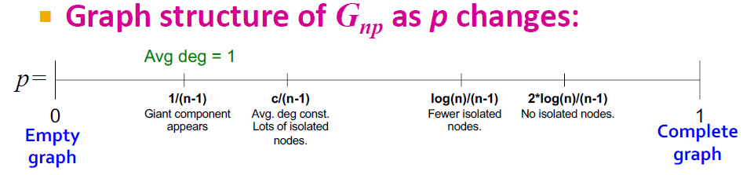

<!-- slide -->
* 2.1、MSN vs. $G_{np}$
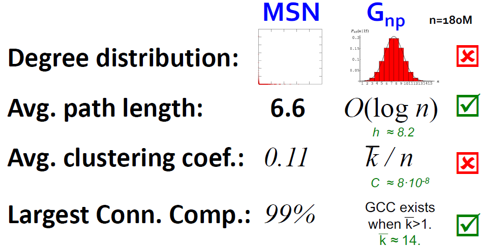
<!-- slide -->
* 3、Small-World Model
一个高聚类系数、短直径的随机图模型。主要思路是从高聚类系数的图出发，引入随机性增加“shortcuts"，从而减小图的直径。
  - step1 建立一个低维的栅格图；
  - step2 增加/删除边，保持度分布的同时增加对远端节点的”shortcuts”联接，对于每个节点重新联接其他节点的概率为p.

<!-- slide -->
* 3.1、重联概率 vs. 聚类系数 vs. 平均路径长度
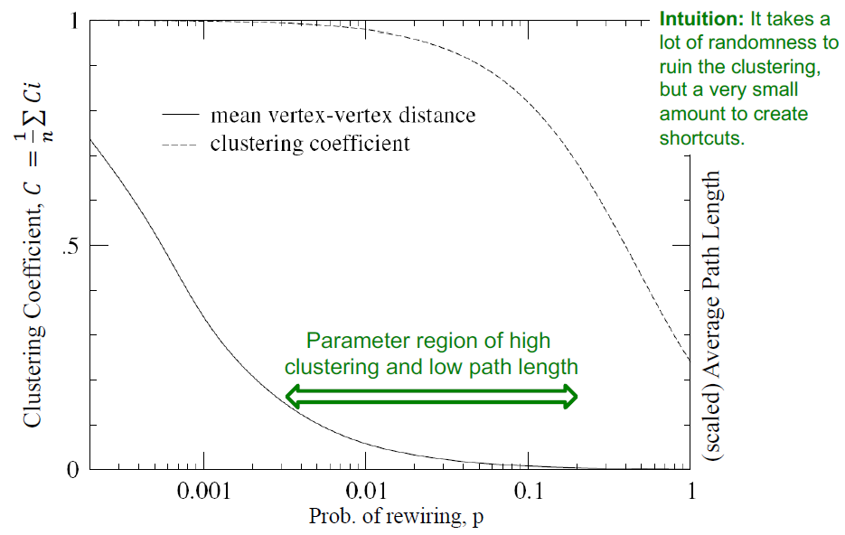
<!-- slide -->

* 4、 Kronecker Graph Model
  * 4.1 随机Kronecker Graph
  - 一种建立大规模随机图的算法。很多图的结构具有相似性，Kronecker Graph就是一种网络结构的迭代模型，通过Kronecker积构建邻接矩阵，从而构建具有自相似性的图。
  - 确定的Kronecker Graph不存在随机性，因此直径很大，因此需要在图中引入随机性，即Stochastic Kronecker Graphs,步骤如下：
    - 1,初始化一个概率邻接矩阵；
    - 2，计算k阶Kronecker积；
    - 3，生成的k阶概率邻接矩阵的元素即边的概率，根据概率引入边，生成图。
<!-- slide -->

* 4.2、Faster Generation
上述方式需要进行对于n阶矩阵需要进行$n^2$次随机抽样以生成边，考虑Kronecker图的递归性，从最内层的$2\times 2$的矩阵出发，递归地决策边，针对有向图。
  - 建立一个标准化矩阵$L_{uv}=\Theta_{uv}/(\Sigma_{op}\Theta_{op})$
  - for i=1...m
    - 从$x=0，y=0$开始；
    - 以概率$L_{u,v}$选择行/列$(u,v)$;
    - 在G的i水平下，下降至四边形(u,v)内，即$x+=u\cdot 2^{m-i},y+=v\cdot 2^{m-i}$
    - 在G内增加一条边(x,y);

  该算法生成的图各项性质与真实网络十分接近。
<!-- slide -->
# 三、subgrpah、motifs and strural role
<!-- slide -->

* 节点数为3的所有非同构子图
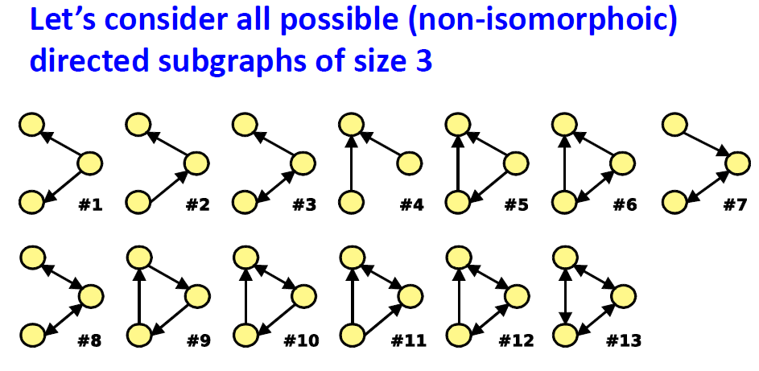
<!-- slide -->
* network significance profile:所有子图类型特征构成的向量，可用于衡量子图的重要性。
* 各种子结构在不同网络种出现的标准化得分(Z-score)
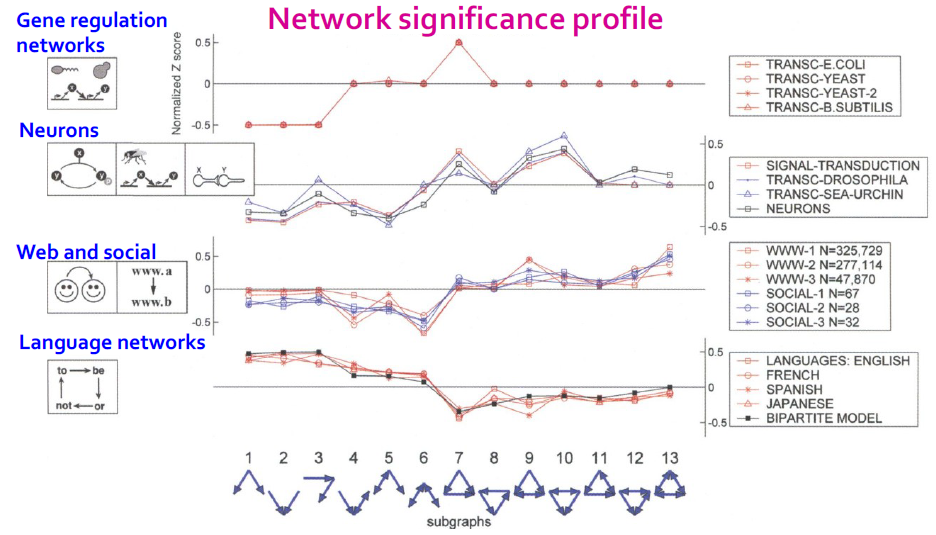
<!-- slide -->
* motif:子图中重复出现的重要的联接模式,可以帮助我们识别理解网络工作的模式，预测在给定情况下网络的反馈或操作。
  - pattern: small **induced** subgraph
  - recurring：高频。
  - significant: 比随机网络(Erdos-Renyi random graph,scale free networks)中出现的频率要高。（具有较高的Z-score)
<!-- slide -->
* induced subgraph:Induced subgraph of graph G is a graph,formed from a subset X of the vertices of graph G and all of the edges connecting pairs of vertices in subset X.
  - 与给定motif的连接方式一致，选定的节点子集间不存在其他连接。

<!-- slide -->
* significance of a motif:Z-score
$$Z_i = (N_i^{real}-\bar{N}_i^{rand})/std(N_i^{rand})$$
* network significance profile(SP):刻画子图的相对重要性。
$$SP_i=Z_i/\sqrt{\sum_j{Z_j^2}}$$
* Configuration Model,用于生成给定度序列下随机图。
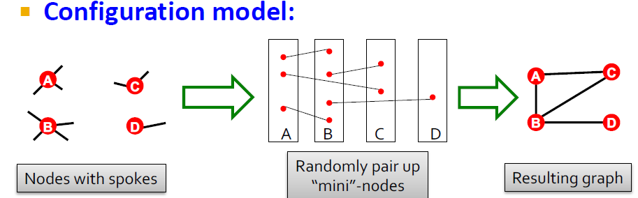
<!-- slide -->
* alternative for spokes:switching
  - 1，从给定的图G（真实图）开始；
  - 2，重复switch操作Q*|E|次(Q为事先确定的一个足够大以保证收敛的数，如100)：
    - 随机选择一对边，
    - 交换两条边的终端节点（保证没有多连边或自连边）。
* motif概率的变体
  - 典型的定义：directed vs. undirected, colored vs. uncolored, temporal vs. static motif
  - 变体：频率定义、重要性定义、under-representation(anti-motif),初始模型的限制。
<!-- slide -->
* Graphlets:
  - 作用：节点级的子图度量，即一个节点与多少graphlet相连。
  - 定义：联通的非同构子图。
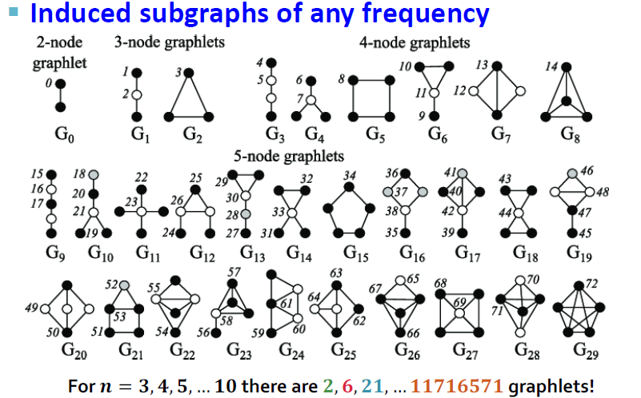
<!-- slide -->
* automorphism orbits
  - 定义：对于给定的图G的节点u,其自同构轨道为 $Orb(u)=\{v\in V(G);v=f(u);f=Aut(G)\}$,其中$Aut$代表G的自同构组，即G中的同构图，即所有自同构图的集合。
* Graphlet degree vector:自同构轨道个数的向量。可以用于度量图的拓扑结构相似性。

<!-- slide -->
* 5个节点的图的GDV有72维。
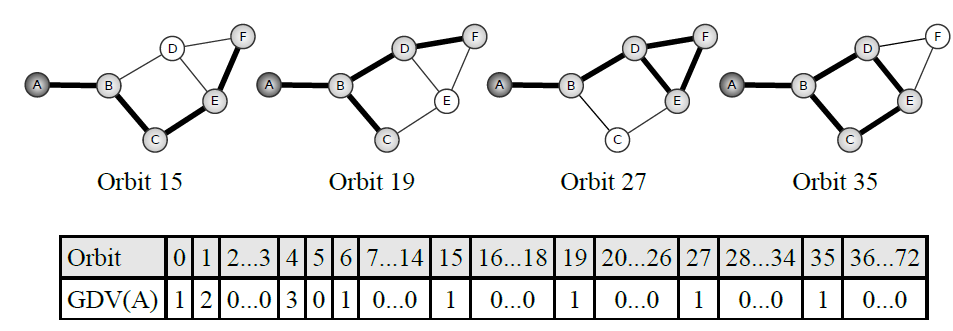
<!-- slide -->
* Find Motif and Graphlet：Enumerating and Counting
  - Enumerating:确定一个子图是否存在一个图内是一个NP-complete问题。
  - counting:Network-centric approaches
    + Exact subgraph enumeration (ESU) [Wernicke 2006],
    + Kavosh [Kashani et al. 2009],
    + Subgraph sampling [Kashtan et al. 2004].
<!-- slide -->
* ESU算法
* Idea:将节点分为两个子集，$V_{subgraph},V_{extension}$,针对每一个节点v，如果节点u满足如下性质则将加入集合$V_{extention}：
  - u的节点id大于v（而不是w）;
  - u为新加入节点w的邻居节点，但不能与$V_{subgraph}$中已经存在的任何节点相邻.
* ESU以一个迭代函数执行,执行方式类似于一个k层的数，称为ESU-tree.
*  如果图G与图H存在双射函数f满足：如果节点u,v在G中相邻，则f(u),f(V)在H中相邻，则G与H同构。

<!-- slide -->
*  ESU算法

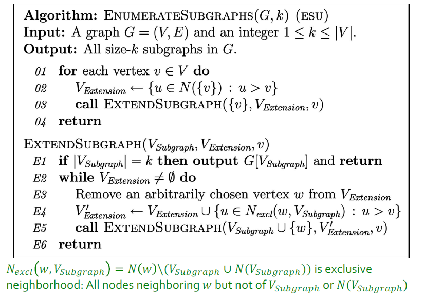
<!-- slide -->
* ESU-Tree 
  

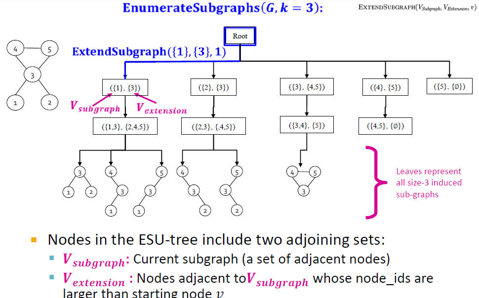
<!-- slide -->
* structure role

* **role**：即节点在网络中的功能，定义为在结构中具有相似位置的节点的集合，根据结构的行为来测度，与group或community的主要区别在于,group或commuity是根据连接性或相似性测度的。
* 结构等价性：如果节点u,v与其他所有节点具有相同的关系，则称u,v具有结构等价性；
* structure role的应用：role query,role outlier,role dynamic,identity resolution,role transfer,network comparison.
<!-- slide -->
* RolX算法
无监督学习；无需先验知识；mixed-membership of roles;$O(|E|)$.

<!-- slide -->
* recusive reature extration:聚合节点的特征用于生成递归地特征
* 节点邻节特征集
  - local features:节点度的所有度量，如有向图的出度和入度，加权图的加权度；
  - egonet featrue:egonet包括已选节点及其邻居节点，以及这些节点的induced subgraph上的所有边，egonet特征包括egonet边的数量，进入或离开egonet的边的数量。
* 聚合函数：mean,sum
* 剪枝：对于相似度高于阈值的任意两个特征，仅保留其中一个。
<!-- slide -->
* **role extraction**

<!-- slide -->
# 四、Community structure in network
<!-- slide -->
* 信息如何传播？
  - 社区外的节点往往能才能提供增量信息，在社交网络中，友谊可以从两个视角分析：
    - 联接两个子网络
    - 节点间的友谊有强弱之分
  - 从而边也有两种role:social和structure：
    - 跨越子网络的边是socially weak的，子网络内的边是socially strong的。
    - 跨越子网络的边允许节点获取其他子网络的信息，而社区内的边在获取信息上往往是多余的。
<!-- slide -->
* 真实数据中的边强度
  - 电话网络，边的强度定义为打电话的次数,边强度越高，邻居间边的重合度越高
  - Edge overlap:$O_{ij}=\frac{|(N_i\cap N_j \setminus \{i,j\}|}{|N_i\cup N_j\setminus \{i,j\}|}$

<!-- slide -->
* edge romoval by strenth vs. link reomoval by overlap

 

<!-- slide -->
* community
  - 定义：强内部联接但弱外部联接的节点子集。
  - modularity Q:衡量社区划分好坏的标准。
    + 给定一个网络划分方法，$Q\propto \sum_{s\in S}{[(\# 内的边)-(\# s内边的期望)]}$
    + Q的计算需要随机图模型：Configuration Model
    + Configuration模型中任意节点i,j间边的期望为：$k_i\cdot \frac{k_j}{2m}$,其中n,m为真实网络G中的节点和边的数量，图中度的和为2m。(也适用于有权重网络)
    + 给定图G，$Q(G,S)=\frac{1}{2m}\sum_{s\in S}\sum_{i\in s}\sum_{j\in s}{(A_{ij}-\frac{k_ik_j}{2m})}$,其中2m为归一化操作,$A_{ij}$为边的权重，无连接为0。
    + $Q\in [-1,1]$,Q在0.3-0.7之间意味着显著的社区结构。
<!-- slide -->
* Louvain算法：通过最大化modularity识别社区
  - $O(n log n)$时间复杂度，支持加权网络，导出分层社区，贪婪算法。
  - 1,允许节点-社区关系局部变化来优化modularity
    + 把每个节点都作为一个社区，针对每个节点i，计算如果该节点与邻居节点组合为一个社会的modularity变化$\Delta Q$，将节点i划入产生最大$\Delta Q$增益的邻居节点,直至没有没有$\Delta Q$增益。
    + 将节点移入社会C的$\Delta Q(i\rightarrow C)=[ \frac{\sum_{in}+k_{i,in}}{2m}-(\frac{\sum_{tot}+k_i}{2m})^2 ]-[\frac{\sum_{in}}{2m}-(\frac{\sum_{tot}}{2m})^2-(\frac{k_i}{2m})^2] $
    + 其中$\sum_{in}$为C内节点的连接权重的和，$\sum_{tot}$表示C内节点**所有**连接权重的和，$k_{i,in}$节点i和C连接权重的和，$k_i$为i的所有连接权重。

<!-- slide -->
* Modularity Gain
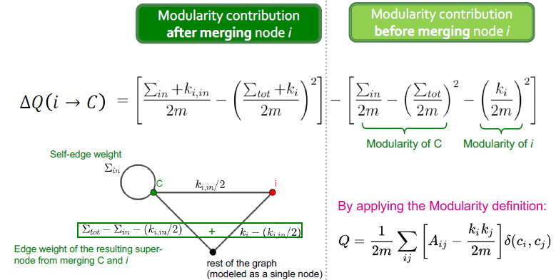

* $\Delta Q(D\rightarrow i)$为将节点移除社区D的modularity增益。最终得到$\Delta Q=\Delta Q(i\rightarrow C)+\Delta Q(D\rightarrow i)$
<!-- slide -->
* 2,识别出的网络聚合为一个超节点来建立新的网络。
  - 如果两个社区内节点至少有一条边，则两个超节点间是联通的；
  - 两个超节点间的权重即两个社区内边的权重之和；
* 在新生成的超节点网络的基础上再进行第一步，直至收敛。
<!-- slide -->
* Louvain Algorithm
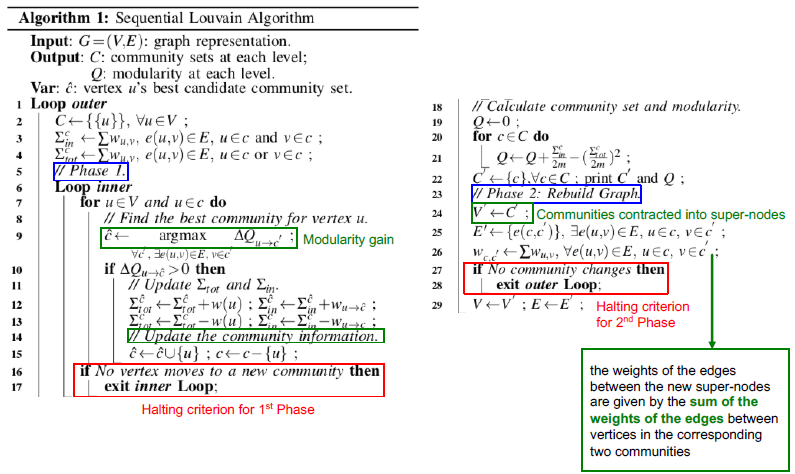
<!-- slide -->
* 检测重叠的社区：BigCLAM
  - 基于社区从属关系定义图生成模型(Community Affiliation Graph Model,AGM)
  - 对于给定图G，假设G由AGM生成，找出与G最相似的AGM。

<!-- slide -->
* AGM模型参数：节点集V，社区集合C，从属关系集合M，每个社区c的概率$p_c$，社区内的节点以$p_c$决定相互的边。
* $p(u,v)=1-\prod_{c\in M_u\cap M_v}{(1-p_c)}$,对于完全不从属于一个社区的节点u和v,其概率为0，模型为解决这个冲突设置了一个"epsilon"社区，每个节点都从属于该社区。
* AGM也可以用于表示非重叠社区、重叠社区、嵌套结构。
<!-- slide -->
* 根据AGM检测社区，即在给定的图G下，找出最符合该图的模型F
  - Affiliation graph M
  - 社区集合C的数量
  - 参数$p_c$。
拟合方法： 最大似然估计 
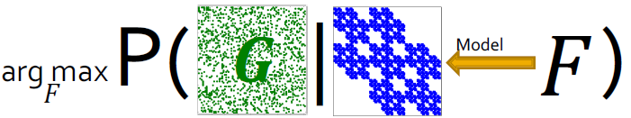
$$P(G|F)=\prod_{(u,v)\in G}{P(u,v)}\prod_{(u,v)\notin G}{(1-P(u,v))}$$
<!-- slide -->
* BigCLAM
* 思路：'relax' AGM-->从属关系强度
  - $F_{uA}$代表节点u从属社区A的强度，$F_u$，u从属每个社区的强度向量.
  - 节点u,v间的联接关系等比于共属社区关系的强度：$P(u,v)=1-exp(1-F_u\cdot F_v^T)$
  - 给定网络$G(V,E)$,最大化$l(F)=\sum_{(u,v)\in E}{log(1-exp(-F_uF_v^T))}-\sum_{(u,v)\notin E}{F_uF_v^T}$
<!-- slide -->
* 步骤：1，随机初始化F；2，固定其他节点的从属关系，更新节点$F_{uC}$
* 优化：梯度上升 $$\nabla l\left(F_{u}\right)=\sum_{v \in \mathcal{N}(u)} F_{v} \frac{\exp \left(-F_{u} F_{v}^{\prime}\right)}{1-\exp \left(-F_{u} F_{v}^{T}\right)}-\sum_{v \notin \mathcal{N}(u)} F_{v}$$
* 纯梯度上升是非常缓慢的，但是：
$$\sum_{v \notin \mathcal{N}(u)} F_{v}=\left(\sum_{v} F_{v}-F_{u}-\sum_{v \in \mathcal{N}(u)} F_{v}\right)$$
* 通过缓存$F_v$，梯度更新时间线性于u的度。
<!-- slide -->
# 五、Spectral Clustering
<!-- slide -->
* spectral clustering algorithms
  - 1, 预处理：构建图的矩阵表示
  - 2，分解：计算矩阵的特征值和特征向量，根据一个或多个特征向量将节点映射到低维空间；
  - 3,分组：基于低维表示为节点指定一个或多个簇。
* 聚类的目标：最大化类内连接，最小化类间连接。
  - cut:端点属于不同集合的边，$cut(A,B)=\sum_{i\in A,j\in B}{w_{ij}}$,如果图为加权图，则$w_{ij}$即权重，否则$w_{ij}\in\{0,1\}$.
  - 图划分标准：minimum-cut,conductance(NP-hard).
  - conductance $\phi(A,B)=\frac{cut(A,B)}{min(vol(A),vol(B))}$,其中$vol(A)=\sum_{i\in A}{k_i}$,A簇中的总加权度
<!-- slide -->
* 记$\boldsymbol{A}$为邻接矩阵，$\boldsymbol{x}$为节点的label/value值向量，则$\boldsymbol{y=Ax}$代表每个节点的邻居节点label/value的合。
* 分解任务则表示为：$A\cdot x=\lambda \cdot x$.
* d-regular图：每个节点的度为d。如果d-regular图是联通的，则第一特征值的特征向量为$\vec{1}$向量，特征值为d，第二特征向量的和为0，从而将节点分为正标签类和负标签类；如果是不联通的，则$\lambda_n=\lambda_{n-1}$;

<!-- slide -->
* Laplacian矩阵：$L=D-A$,L半正定，特征向量为实向量且正交。
* $\lambda_2=\underset{x:x^Tw_1=0}{min}{\frac{x^TMx}{x^Tx}}$，$w_1$为最小特征值对应的特征向量。
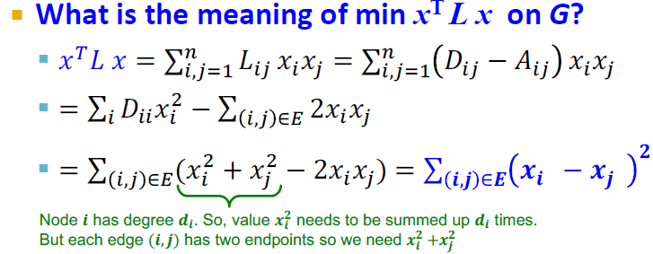
<!-- slide -->
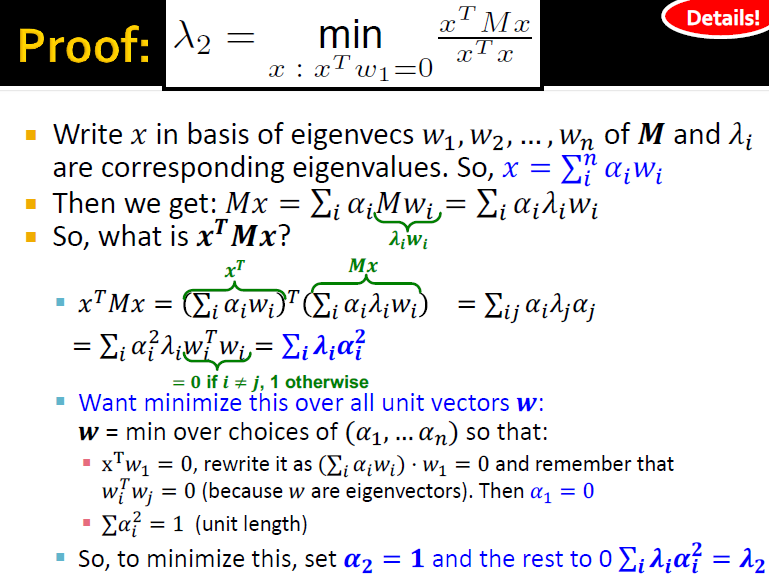
<!-- slide -->
* 对于优化$min{\frac{x^TMx}{x^Tx}}$,$ x^TMx$代表$cut(A,B)$优化，$x^Tx$代表各类节点数量的优化。
* 最小特征值0的特征向量$(1,1,1...,1)$代表将全体子图作为一个类簇，其优化目标的值为0，但这种划分没有意义。因此转而优化第二小特征值，从而将图划分为两类。
* 对优化目标两边同乘x，可以得到$\lambda_2 x = \underset{x:x^Tw_1=0}{min}Mx$,即在第一特征值约束下的第二小特征值。
<!-- slide -->
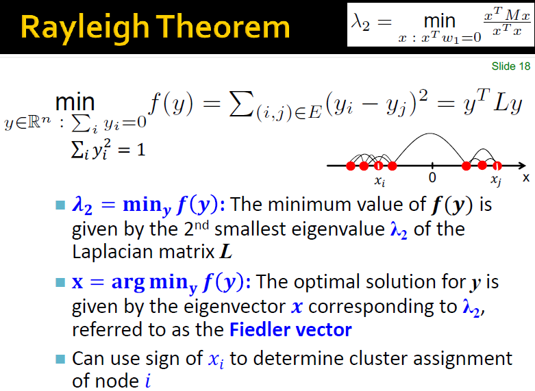
<!-- slide -->
* 谱聚类的收敛性
  - 假设对G的划分A,B满足$|A|<=|B|$,则在$conductance$约束下的划分目标值为$\beta = \frac{\# 从A到B的边}{|A|}$.则必有$\lambda_2\leq 2\beta$
  - Cheeger inequality:$\frac{\beta ^2}{2k_{max}}\leq \lambda _2\leq 2\beta$,其中$k_max$为图中最大的度节点。
* k簇谱聚类
  - 1，迭代地进行二分谱聚类；2，多特征向量聚类，即使用前k个最小的特征向量。（preferable)
  - 选择k的方法：$max \Delta_k = |\lambda_k-\lambda_{k-1}|$
<!-- slide -->
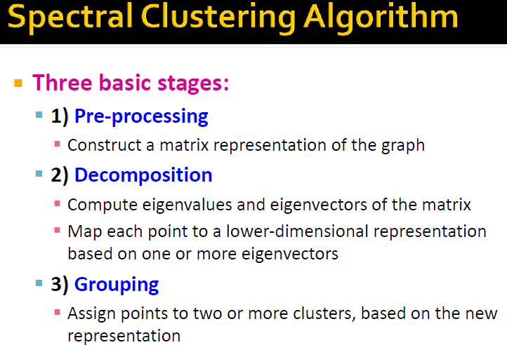
<!-- slide -->
* 基于motif的谱聚类(NP-hard)
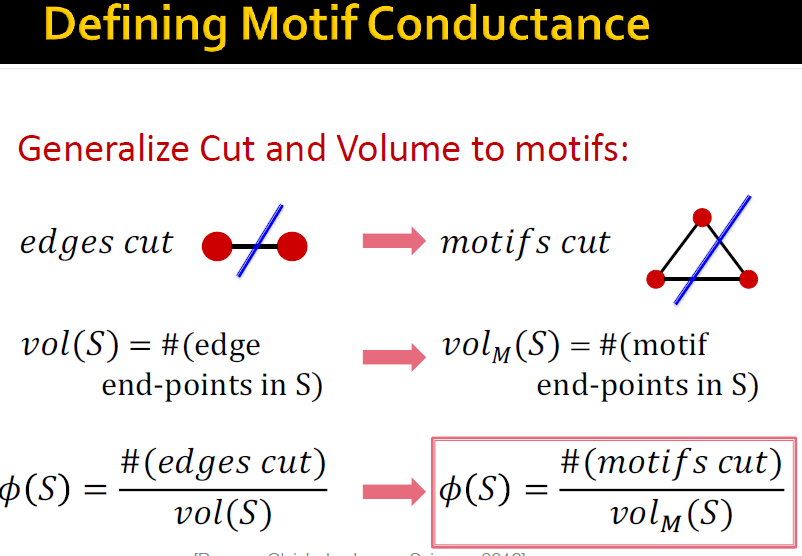
<!-- slide -->
* motif conductance的优化
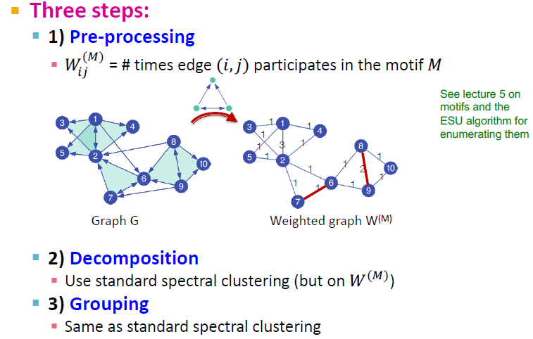
<!-- slide -->
* motif Cheeger不等式
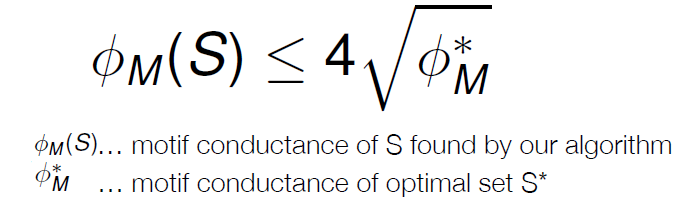
* 其他分割算法：METIS，Graclus,Louvian,Clique percorlation method
 - [METIS](http://glaros.dtc.umn.edu/gkhome/views/metis)
 - [Graclus](http://www.cs.utexas.edu/users/dml/Software/graclus.html)
 - [Lovian](http://perso.uclouvain.be/vincent.blondel/research/louvain.html)
 - [Clique percorlation](http://angel.elte.hu/cfinder/)
<!-- slide -->
# 六、信息传递与节点分类
<!-- slide -->
* 节点分类：给定网络与部分节点的标签，为每一个节点指派标签。
* 三种相关关系：同质(Homophily,物以类聚)，影响(influence，社会联系会影响个体的特征),混同(confounding)。
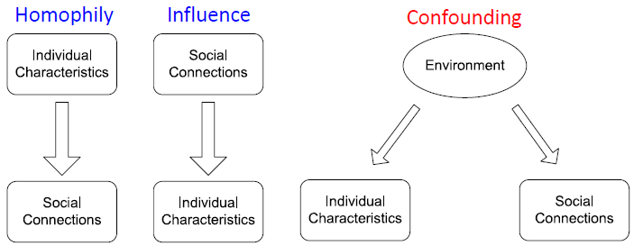
<!-- slide -->
* 相似性的决定因素：1，节点的特征；2，节点邻居节点的标签；3，节点邻居的特征。
* guilt-by-association:定义$W$为邻接矩阵，$Y=\{-1,0,1\}^n$为标签向量，任务为预测哪些无标签节点可能是正样本。
* collective classification:使用相关性对互连节点进行同时分类.
* 应用领域：文档分类、词性标注、链路预测、OCR、图片分割、消歧、欺诈或垃圾邮件检测。
<!-- slide -->
* Markov假设：$P(Y_i|i)=P(Y_i|N_i)$
* collective分类分为三步：
  - 1，局部分类，为节点指派初始标签；
  - 2，关系分类，获得节点间的相关关系；
  - 3，集合推断，通过网络进行关系传播。
* 对集合进行精准推断只适用于特定的网络，对任意网络而言则是NP-hard问题；
* 近似算法：Relation classifiers;Iterative classification;Belief propagation.
<!-- slide -->
* 概率关系型分类器
  - 节点标签的概率是其邻接节点标签概率的加权平均。
  - 步骤：对于有标签节点，初始化标签即其真实标签；对于无标签节点，初始化标签服从均匀分布。以随机顺序更新节点直至收敛或迭代预算耗尽。
  - 节点标签概率更新规则：$P(Y_i=c)=\frac{1}{\sum_{i,j}\in E{W(i,j)}}\sum_{(i,j)\in E}{W_{(ij)P(Y_j=c)}}$,其中，$W_{(i,j)}$为i到j的边的强度。
  - 缺点：不一定收敛；没有使用节点特征信息。
<!-- slide -->
* 迭代分类器
  - 基本思想为基于邻居节点label和自身的特征进行分类。
  - 步骤,Bootstrap+Interation：对于每个节点创建一个flat向量$\alpha_i$,基于向量训练分类器(SVM,kNN等)，使用聚合函数（sum,mean,mode)聚合邻居节点的信息，迭代更新向量和标签，直至收敛或迭代预算耗尽。
  - 缺点：不一定收敛。
<!-- slide -->
* 迭代分类器框架的应用$REV_2$：虚假评论/评论人检测
  - 用户产品体系构成二部图，边即打分的分数。
  - 模型对用户有公平性得分$F(u)\in [0,1]$，对评价有可靠性得分$R(u,p)\in[0,1]$,对商品有好坏度评分$G(p)\in[-1,1]$,迭代分类器更新规则为固定其中两个，更新其余一个。
  - 更新规则：$F(u)=\frac{\sum_{(u,p)\in Out(u)}{R(u,p)}}{|Out(u)|}$, $G(p)=\frac{\sum_{(u,p)\in In(p)}{R(u,p)\cdot socre(u,p)}}{|In(p)|}$,$R(u, p)=\frac{1}{\gamma_{1}+\gamma_{2}}\left(\gamma_{1} \cdot F(u)+\gamma_{2} \cdot\left(1-\frac{|\operatorname{score}(u, p)-G(p)|}{2}\right)\right)$
  - $REV_2$的特点：1，必然收敛；2，收敛的迭代次数存在上限；3，时间复杂度$O(|E|)$
<!-- slide -->
* Belief Propagation
  - 信念传播是一种动态规划方法以回答图模型中的条件概率查询，它迭代地处理节点间的信息传递，当取得一致信念时，计算最终的信念。
* Loopy BP算法
  - 1，标签-标签隐矩阵$\psi$：节点与其邻居节点的相关性，$\psi(Y_i,Y_j)$等于在节点j有邻居节点i处于状态$Y_i$的条件下，处于状态$Y_j$的概率；
  - 2，先验信念$\phi$：$\phi_i(Y_i)$为节点i处于状态$Y_i$的概率；
  - 3，$m_{i\rightarrow j}(Y_j)$：代表节点i对节点j处于状态$Y_j$的估计。
<!-- slide -->
* 信念迭代更新公式：
  - $m_{i \rightarrow j}\left(Y_{j}\right)=\alpha \sum_{Y_{i} \in \mathcal{L}} \psi\left(Y_{i}, Y_{j}\right) \phi_{i}\left(Y_{i}\right) \prod_{k \in \mathcal{N}_{i} \backslash j} m_{k \rightarrow i}\left(Y_{i}\right)$
* 收敛后的信念更新公式：
  - $b_{i}\left(Y_{i}\right)=\alpha \phi_{i}\left(Y_{i}\right) \prod_{j \in \mathcal{N}_{i}} m_{j \rightarrow i}\left(Y_{i}\right), \forall Y_{i} \in \mathcal{L}$
* 优势：1，可并行；2，通用性高，使用任何类型图模型和隐矩阵，网络中如果存在循环时依然有效。 
* 劣势：不一定收敛，尤其是当图中有较多闭环。
* 隐函数：1，需要训练来估计；2，基于梯度优化；
<!-- slide --> 
* 信念传播网络
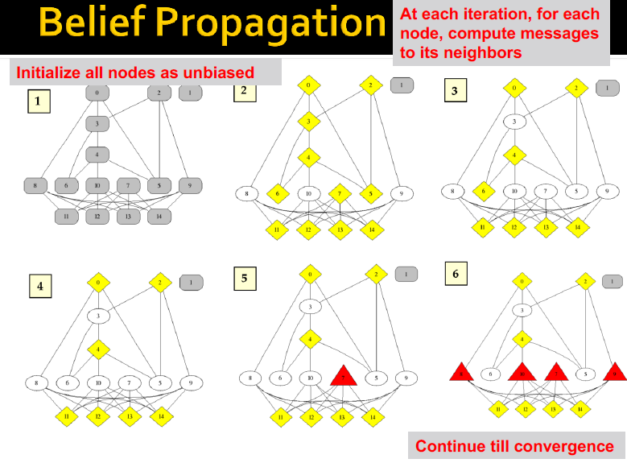
<!-- slide -->
* 文献
[RVE2](https://cs.stanford.edu/~srijan/pubs/rev2-wsdm18.pdf)
[Netprobe: A Fast and Scalable System for Fraud Detection in Online Auction Networks](https://kilthub.cmu.edu/articles/NetProbe_A_Fast_and_Scalable_System_for_Fraud_Detection_in_Online_Auction_Networks/6607661/files/12098213.pdf)
<!-- slide -->
# 七、图表示学习
<!-- slide -->
* 图表示学习的难点
  - 复杂的拓扑结构；没有固定的节点顺序或参考点（即同构性问题）；动态且具有多种模态的特征；
* 图表示学习的目标
  - 将节点映射到低维空间，使得相似(如何定义相似性)节点在低维空间仍具有相似性;
* 图表示学习的要素
  - 编码器 $ENC(u)=z_v$ (如属于embedding lookup的DeepWalk,node2vec,TransE）；
  - 相似度函数；$similarity(u,v)\simeq z_v^Tz_u$，基准有：相邻；有共同邻居节点；具有相似的“structural roles"等。
<!-- slide -->
* [Random Walk](https://arxiv.org/pdf/1403.6652.pdf)
  - 给定图和起始点，按给定策略随机游走，任意两个节点的相似性以随机游走中的共线概率度量；
  - 优点：
    + 良好的表示能力，能融合局部和高阶邻域信息；
    + 高效，训练时仅需考虑随机路径上的共现节点；
  - 目标函数：
    + $\max _{\mathrm{z}} \sum_{u \in V} \log \mathrm{P}\left(N_{\mathrm{R}}(u) \mid z_{u}\right)$,其中$N_R$为策略R下u的邻居节点。
<!-- slide -->
* Random Walk优化

<!-- slide -->
* [node2vec](https://cs.stanford.edu/~jure/pubs/node2vec-kdd16.pdf)
* 出发点：Random Walk中的相似性比较局限，node2vec放松了邻居节点的定义，提出有偏2阶随机游走（BFS+DFS，局部+全局)来产生邻居节点集合。
* biased fixed-length random walk有两个参数：return参数p,In-Out参数q,q代表了BFS vs. DFS的相对大小。
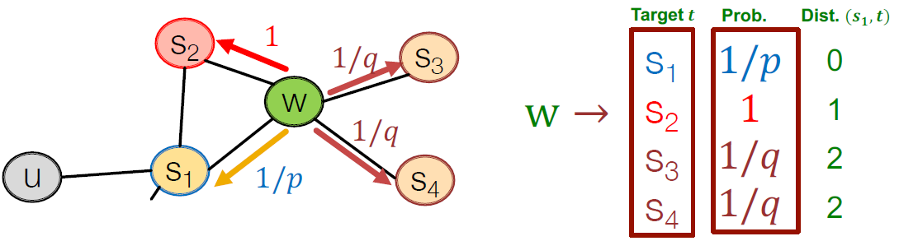
<!-- slide -->
* summary
  - 不同的embedding方法适用不同的任务，如node2vec适用节点分类，multi-hop类方法适用于链路预测。
  - 不同的节点相似性：基于相邻关系；multi-hop相似性；随机游走类方法；
<!-- slide -->
* [TranE](http://papers.nips.cc/paper/5071-translating-embeddings-for-modeling-multi-relational-data.pdf)
  - KG Completion(Link Prediction),图谱中常常会出现关系缺失问题，图谱补全是图谱的基本任务。
  - 在TransE中，实体的关系表示为三元组：(h,l,t)，头实体，关系，尾实体。关系表示为translation,使得$h+l\simeq t$.

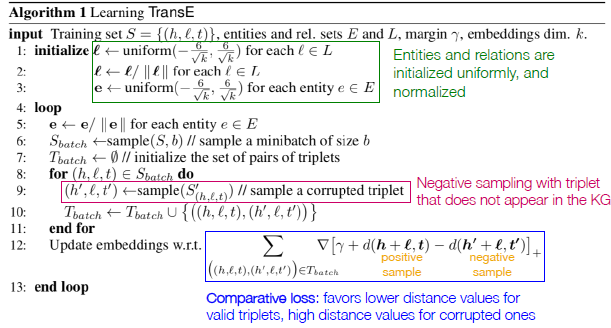、

<!-- slide -->
* Embeding Entire Graph
  - 方法一：首先对节点进行嵌入，然后使用节点向量的和作为图的向量。
  - 方法二：引入虚拟节点，来表示图或子图，然后使用标准节点嵌入方法。
  - 方法三：[Anonymous Walk Embeddings](https://arxiv.org/pdf/1805.11921.pdf),匿名游走中的状态对应于随机游走中首次访问到节点的索引,随着访问长度增加，nonymous walk的数量将呈指数级增加。

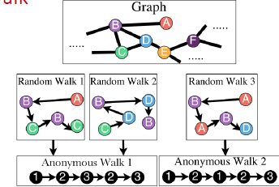

<!-- slide -->
* anonymous walk
  - 1，**穷举**固定长度下所有可能匿名游走，将图表示为这些匿名游走的概率分布。如长度为3，匿名游走的可能情况为5，则图可以表示为一个5维向量。
  - 2，在固定长度下进行$m$次匿名游走**采样**，计算对应的经验概率，$m$的选择依据为，：
     + $m=\left[\frac{2}{\varepsilon^{2}}\left(\log \left(2^{\eta} - 2\right)-\log (\delta)\right)\right]$
     + 其中$\eta$为固定长度下匿名游走的类型数，$\delta$为概率阈值，$\epsilon$为误差阈值。
  - 3，对每个匿名游走$a_i$**学习**一个嵌入向量$z_i$，图的表示即所有$z_i$的聚合（sum\average\concatenation).
<!-- slide -->
* learn walk embedding
  - 思路类似于随机游走：$P(w_t^u|w_{t-\Delta}^u,...,w_{t-1}^u)=f(z)$
  - 1, 对每个节点u，采样T个固定长度的匿名游走，$N_R(u)=\{w_1^u,w_2^u,...,w_T^u\}$。
  - 2, 学习$\Delta$窗口内的共现概率：
     + $max\ \frac{1}{T}\sum_{t=\Delta}^T{logP(w_t|w_{t-\Delta},...,w_{t-1})}$,
    + $P\left(w_{t} \mid w_{t-\Delta}, \ldots, w_{t-1}\right)=\frac{\exp \left(y\left(w_{t}\right)\right)}{\Sigma_{i}^{\eta} \exp \left(y\left(w_{i}\right)\right)}$
    + $y(w_t)=b+U\cdot (\frac{1}{\Delta}\sum_{i=1}^{\Delta}z_i)$
<!-- slide -->
# 八、GNN
<!-- slide -->
* 浅层编码器的缺点
  - 没有参数共享，参数数量线性于节点数量，每个节点的嵌入向量都不同。
  - transductive学习，只能处理训练过的数据，不具有泛化性。
  - 没有融入节点特征。
* 深度学习应用于图网络的问题
  - 矩阵表示大小不固定，拓扑结构复杂；
  - 没有固定的节点顺序和参考点
  - 动态、多模态；
<!-- slide -->
* GCN
  - 基本思想：节点的邻居节点定义了计算图，通过聚合不同层次的邻居节点(特征)来传递信息。
  - 不同层级的邻接关系对应卷积网络不同的layer。
  - permutation invariant问题（在gnn中节点顺序必须固定）。

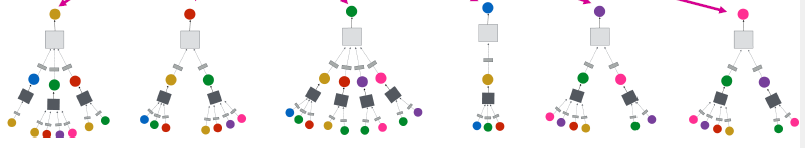

<!-- slide -->
* 邻居节点的聚合
  - 方法1，对邻居节点信息进行平均，而后应用神经网络。
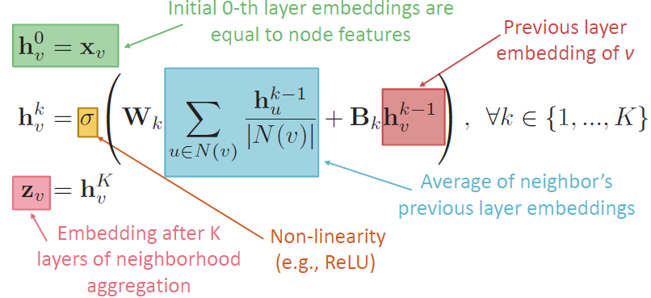
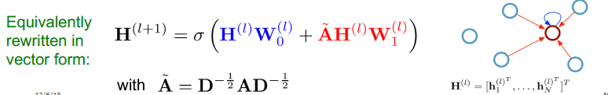
<!-- slide -->
* GNN的训练
  - 无监督训练
    + 仅使用图结构，损失函数可基于浅层编码器算法(node2vec,deepwalk,struc2vec),图分解，或者图的node proximity。
  - 有监督训练
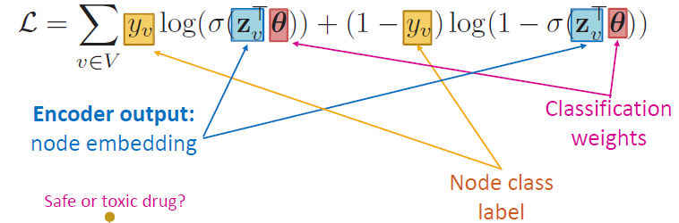
<!-- slide -->
* GraphSAGE
  - 主要思想是不再使用均值来作为节点的聚合函数，而是使用更泛化的聚合函数(pool,lstm,mean)。
  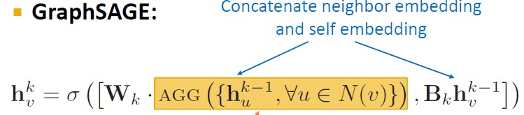
  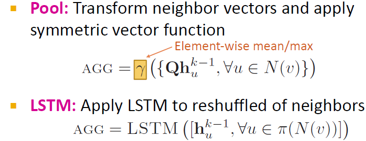
<!-- slide -->
* 高效执行
  - 矩阵操作可以提高多种聚合函数的执行效率，如：

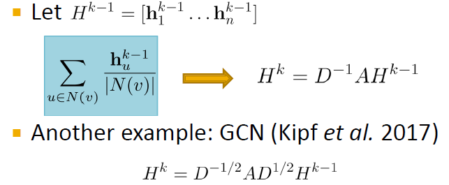

<!-- slide -->
* 其他GNN变体与技术
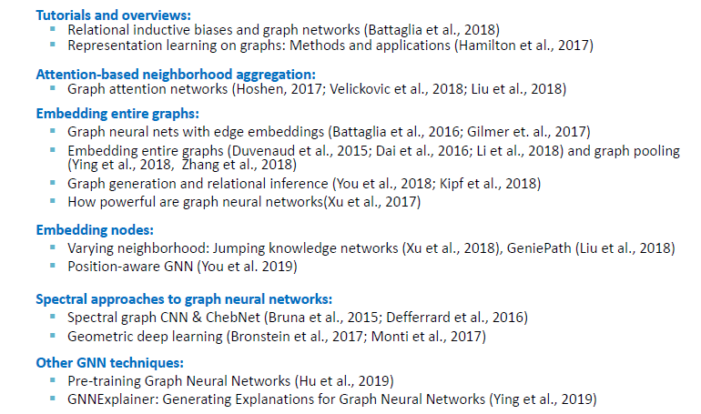
<!-- slide -->
* GAN(1)
  - GNN将每个邻居节点的信息等权的对待，在一些场景中与事实不符，GAN则允许隐式地对不同节点分配不同的权重。
  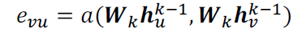
  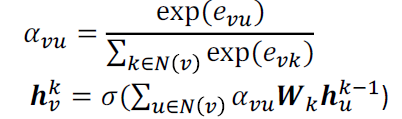
  - 其中，$e_{uv}$节点u对v的重要性，$alpha_{uv}$为标准化的重要性，$\mathbf{h}_v^k$为节点v的嵌入表示。
<!-- slide -->
* GAN(2)
  - attention机制$a$没有固定的选项，可以有自身的参数，参数可以与模型联合训练。
  - multi-head attention:每一层的attention由多个独立的attention机制构成，最终的输出可以是multi-head attention的拼接或相加。
  - attention系数的计算是可并行的，存储空间要求不高于$O(V+E)$,参数数量固定，仅关注局部结构，不依赖全局图结构，是一种共享edge-wise机制。
<!-- slide -->
* PinSAGE
  - 主要创新：
    + 邻居节点的子集抽样提高了GPU执行效率；
    + 生产者-消费者 CPU-GPU训练流程；
    + 负样本的curriculum learning；
    + 基于MapReduce的高效推断；
<!-- slide -->
* tips
  - 预处理:使用二次标准化策略；variance-scaled初始化策略；数据白化(whitening)
  - Adam优化器；ReLU激活函数；bias项；
  - 64或128层的神经网络对处理图数据已经足够了。
<!-- slide -->
# 十、深度图生成模型
<!-- slide -->
* 图生成问题： 给定真实图，拟合该图，生成人工图，包括两种：真实图重构，goal-directed图生成。
  - 适用场景：图生成，异常检测，动态预测，模拟新的图结构，图补全。
  - 存在的问题：
    + 1，大规模且可变的生成空间，如对于n各节点的图需要生成$n^2$个值；
    + 2，没有唯一的表示方法，如节点顺序发生变化，图的表示也会变化，从而难以计算和优化目标函数；
    + 3，复杂的依赖关系：边队列间存在长程依赖，一条边的存在与否依赖于其他边。
<!-- slide -->
* 图生成模型：给定图的采样数据，拟合采样数据，学习图分布模型，生成新的图数据。
* 生成模型基本原理：极大似人估计，$\boldsymbol{\theta}^{*}=\underset{\boldsymbol{\theta}}{\arg \max } \mathbb{E}_{x \sim p_{\text {data }}} \log p_{\text {model }}(\boldsymbol{x} \mid \boldsymbol{\theta})$，设计采样映射函数使得$x_i=f(z_i;\theta)$,其中$z_i\sim N(0,1)$或其他简单分布，$f$为映射函数，常使用深度神经网络。
* 通常使用自回归模型，自回归模型兼具密度估计和抽样的功能，(但其他模型如变分自编码器，生成式对抗网络则将二者分离。)
  - $p_{\text {model}}(x ; \theta)=\prod_{t=1} p_{\text {model}}\left(x_{t} \mid x_{1}, \ldots, x_{t-1} ; \theta\right)$

<!-- slide -->

* 深度生成模型的分类

<!-- slide -->
* GraphRNN
  - 主要思路：序贯地增加节点和边。由此必须唯一地确定节点顺序，才能进行建模，设预选确定的节点顺序为$\pi$，则增加节点和边的序列可表示为$S^{\pi}$
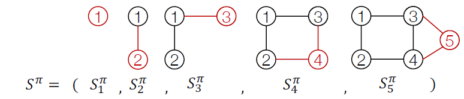
  - $S^{\pi}$有两个水平，节点水平为每次增加一个节点，边水平即对已加入节点添加边。
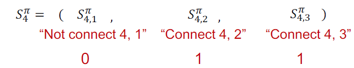
<!-- slide -->
* model graphs as sequences
  - 通过序贯增加节点和边的操作，图生成任务转化为序列生成问题，分为两步：第一步为对新节点生成新的状态，第二步为根据新节点的状态生成新的边。
  - 方法：RNN。RNN模型也分为两个水平的RNN，节点水平的RNN用于生成边水平的RNN的初始状态，边水平的RNN生成新节点的边，并根据生成的结果更新节点水平RNN的状态。

<!-- slide -->
* RNN
  - 基本符号，$s_t,x_t,y_t$t时刻的状态、输入和输出，$s_t=\sigma(W\cdot x_t +U\cdot s_{t-1})$,$y=V\cdot s_t$
  - 自回归模型即$x_{t+1}\sim y_t=p_{model}(x_t|x_1,...,x_{t-1}|\theta)$,同时增加$SOS,EOS$作为开始和结束标志；
  - 每一步，RNN输出概率向量，并从概率向量中采样作为下一次的输出。
  - 使用二项交叉熵构建损失函数。
<!-- slide -->
* 测试时的RNN
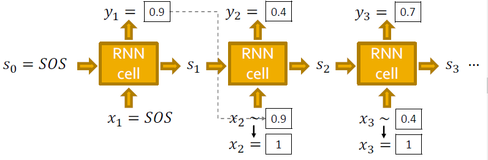
* 训练时的RNN:根据真实标签$y^*$替换输入输出进行训练
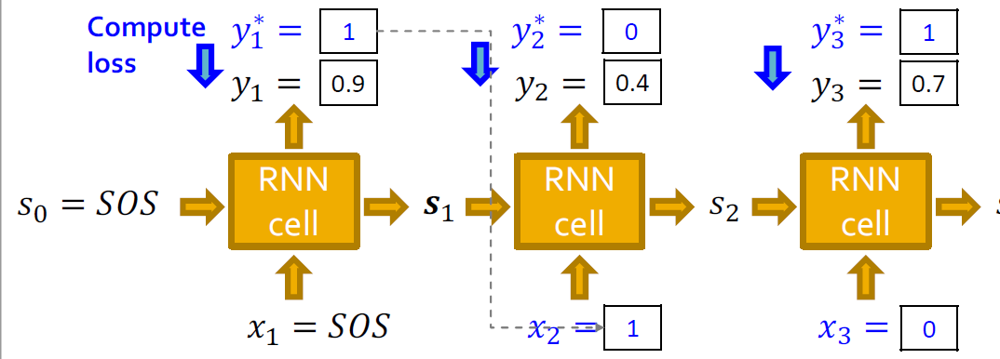
<!-- slide -->
* 训练流程
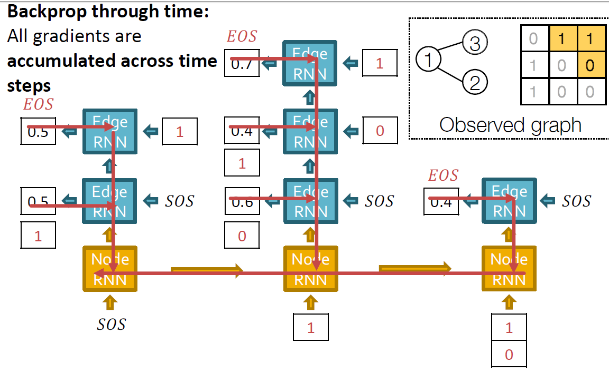
<!-- slide -->
* 可溯源性(tractability)
  - 每个节点都可能和之前的节点相连，因此预测一条边是否存在需要生成完整的邻接矩阵，复杂度较高，需要对节点的访问策略进行限制--> BFS节点顺序
  - BFS节点顺序只需要记住每个节点的邻接情况，减少了节点的溯源步数。
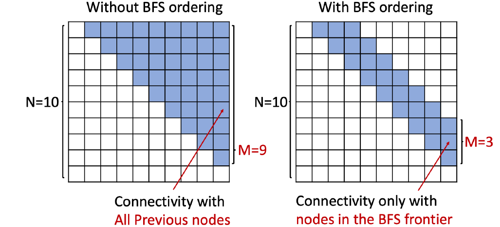
<!-- slide -->
* 评估生成图
  - 没有适用于所有类型的图的有效的图同构测试，目前只有两种策略：视觉相似性和图统计量相似性。
* 应用：药物发现。(Graph Convolutional Policy Network for Goal-Directed Molecular Graph Generation,2018),图表示+RL
* 图生成的热点：1，应用于其他领域；2，适用于大规模网络,3，异常检测等任务。
<!-- slide -->
# 十一、连接分析：PageRank
<!-- slide -->
* Web的结构
  - 网页即节点，超链接构成边，Web可视为一个超大的有向图，有向图又分为两种：有向无环图和强连接图，所有有向图都是基于连通成分的有向无环图。
  - 问题一：找出包含某节点v的最大连通成分，$Out(v)\cap In(v)$,根据该方法，Web的结构类似于如下的蝴蝶结。

<!-- slide -->
* Link Analysis
  - 出发点：不同网页的重要性不同，如何根据网络的结构对网页的重要性进行排序，即Link Analysis算法,主要有三种算法：PageRank，Personalized PageRank,Random Walk with Restarts.
  - 思路：将超链接视为投票，但不同链接的重要程度也会不同，因此基于投票的思路是一个递归问题。
  - 每个链接的投票权等比于源网页的重要性，即如果网页i的重要性为$r_i$，其有$d_i$个出链接，则每个链接的投票权为$r_i/d_i$，每个网页的重要程度$r_j$即所有入链接投票权的和，$r_j = \sum_{i\rightarrow j}{\frac{r_i}{d_i}}$.
  - 如果网页$j$有$d_j$个出链接，且某链接指向网页$i$，则记行随机矩阵为$M$,则$M_{ij}=\frac{1}{d_j}$,则PageRank可向量化表示为：$\mathbf{r=M\cdot r}$
<!-- slide -->
* 基于随机游走的解释
  - 假设在时刻$t$,网络用户在网页$i$,在时刻$t+1$，用户在i的出联接中随机选择一个，重复该过程，用户点击每个网页的可能性存在一个稳定的分布。记$p(t)$为t时刻网页点击分布，其中某i个分量代表代表用户在t时刻停留在网页i的可能。
  - 记$\mathbf{M}$为转移概率矩阵，则网页转移问题可表示为：$\mathbf{p(t+1)=M\cdot p(t)}$,则稳定概率分布满足$\mathbf{p(t+1)=M\cdot p(t)=p(t)}$,问题进一步转化为求$\mathbf{M}$的特征值为1的特征向量，方法为：Power iteration.
  - Power iteration:1,以均匀分布初始化$r^{(0)}=[1/N,...,1/N]^T$;2,$r^{(t+1)}=M\cdot r^{(t)}$或者$r_j^{(t+1)}=\sum_{i\rightarrow j}\frac{r_i^{(t)}}{d_i}$;3,当$|r^{(t+1)}-r^{(t)}|_1<\epsilon$时停止迭代；
<!-- slide -->
* 求解 PageRank
  - PageRank有两个问题，其一是dead ends 没有出链接，导致重要性"泄露"；其二是“spider trap”,出链接构成自环，最终spider trap将吸收所以重要性；

<!-- slide -->
* 解决spider trap的方法
  - 为用户的行为增加不确定性，以概率$\beta \sim [0.8,0.9]$遵循外连接，以$1-\beta$随机选择网页；
* 解决 dead ends的思路
  - 令spider trap中的$beta=0$，即以概率1跳转至其他无关页面。
* spider trap并不会使PageRank算法失效，但得到的重要性得分没有任何意义；但dead end,会使PageRank算法失效，因为这会使矩阵的列非随机，从而不满足初始假设。
* PageRank公式：$r_{j}=\sum_{i \rightarrow j} \beta \frac{r_{i}}{d_{i}}+(1-\beta) \frac{1}{N}$
* 谷歌矩阵 $A=\beta M +(1-\beta)\frac{1}{N}$,从而$r=A\cdot r$。
* 增量更新公式：$r=\beta M\cdot r +[\frac{1-\beta}{N}]_{N}$
<!-- slide -->
* 完整算法
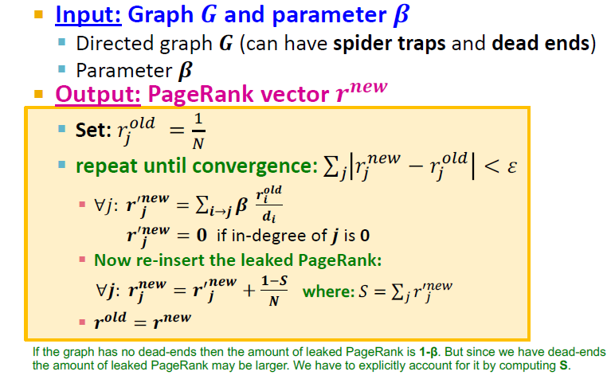
<!-- slide -->
* 重起始的随机游走与个性化PageRank
  - personalized PageRank,为节点的相似性进行排序，并推荐给远端节点。
  - random walk with restart,远端节点回溯至初始节点。具体为：给定初始节点集，每次随机选择一个邻居节点，并记录访问过程，同时以概率$\alpha$返回初始一个节点，重复多次，被访问次数最多的节点与初始节点集最相似。
<!-- slide -->
* pixie  random walk algorithm
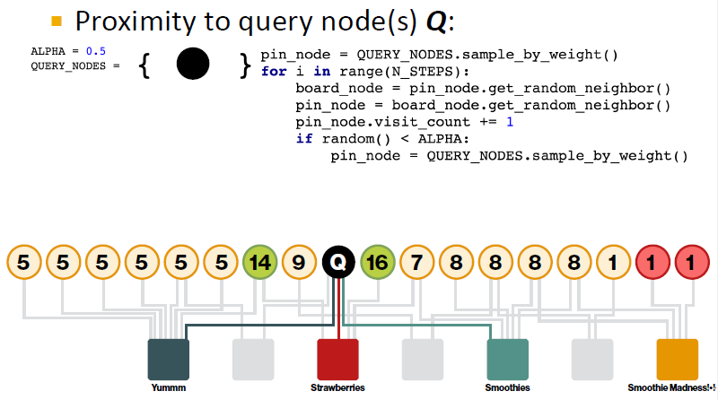
<!-- slide -->
# 十二、network effects and cascading behavior
<!-- slide -->
* 节点与节点的cascade是指节点的行为的传播/传染，如媒体扩散，病毒营销，社交网络扩散，病毒传播。
  - 对扩散的建模，基于决策的模型（病毒传播）v.s.概率传播模型（传染病）。
  - cascade的博弈论模型，基本假设：如果两个节点$v,w$选择同样的决策$A$，则得的正奖励$a$，如果同时选择$B$,得到奖励$b$,否则奖励为0.假设选择行为$A$节点的比例为$p$,选择行为$B$的节点的比例为$1-p$,如果$p>\frac{b}{a+b}$，则节点会转而选择$A$。

<!-- slide -->
* 社交网络中的抗议着招募
  - 例子：西班牙的愤怒者运动(indignados),旨在反紧缩(anti-austerity)。研究者通过分析抗议者的hashtags，创建了两个无向follower网络，其一是全网络，其二是对称网络，对称网络即相互follow的子网络。
  - 定义：用户激活时间，指当用户开始发表抗议twiter的时间；$k_{in}$当用户激活时的全部邻居节点数，$k_a$当一个用户激活时处于激活状态的邻居节点数，$k_a/k_{in}$激活阈值,即用户处于激活状态时，其处于激活状态的邻居节点的比例。
  - 如果$k_{a}/k_{in}\simeq 0$,表示没有社交压力时，用户加入抗议；如果$k_a/k_{in}$，指在强大的社交压力下，用户加入抗议。
<!-- slide -->
* 激活阈值几乎是均匀分布的，除了两个局部极值

* 如果邻居节点的激活时间较短，则本节点的激活时间也较短，burstiness$\Delta k_a/k_a=(k_a^{t+1}-k_a^t)/k_a^{t+1}$

<!-- slide -->
* 识别cascade:如果一个节点发了一条推特，在$\Delta$时间内，他的某个follower也发了一个推特，则它们构成一个cascade.
* size:一个cascade的节点。大多数cascade的size都比较小。size大的cascade称为成功的cascade.
* 一个成功的cascade的发起人是否是网络的中心节点。检验方法:k-核分解
  - k-核：每个节点的度都至少为k的最大联通子图。
  - 分解方法：重复移除度少于k的节点。如果某个节点有多个k-core，则该节点更倾向于中心节点。
  - 结论：一个成功的cascade的发起人是网络的中心节点.
<!-- slide -->
* cascade行为建模
  - 特点；基于效用，确定性的，节点为中心，即节点观察到其他节点的决策而后做决策。
  - 模型的扩展:同时采取两种行为，即$AB-A\rightarrow a,AB-B\rightarrow b,AB-AB\rightarrow max(a,b)$,如果同时采取两种行为则成本为$c$.模型中决策的初始行为为$B$,而后某节点子集$S$转向$B$.
  - 当且仅当$a>b+c$行为A才会传播。如果$A:a,B:1,AB:a+1-c$，对于情形如图左其决策如图右：

<!-- slide -->
# 十三、概率感染模型与影响力建模
<!-- slide -->
* 概率传染模型
  - 基于随机树的传染模型，每个病人会遇到$d$个人，每个人被传染的概率为$q$，记在深度为h的人被感染的概率为$p_h$,则$p_h=1-(1-q.p_{h-1})^d$,即在给定的q,d下，每一层被感染的概率取决于上一层被感染的概率，故每层的感染概率可公式化为一个迭代函数$f(x)=1-(1-q\cdot x)^d$,f是一个单调不减的函数。
- 不动点：满足$f(x)=x$的点称为不动点.

<!-- slide -->
* die out的条件：$f'(0)=q\cdot d < 1$,其中$R_0=q\cdot d$称为繁殖数，决定了传染病是传播还是逐渐消亡。从而如果控制接触人数从而减少d,或者改善卫生行为(sanitary practices)从而降低q，可以控制疾病的传染。
* HIV的$R_0$为2-5，麻疹(Measles)的$R_0$为12-18，埃博拉(Ebola)的$R_0$为1.5-2(致死率高达88%故d较小)
* Flickr社交网络中的cascades与$R_0$估计
  - 估计$q$:给定已感染节点，其邻居节点被感染比例的期望。
  - 估计$R_0$：$R_0 = q\cdot d\cdot \frac{avg(d_i^2)}{(avg d_i)^2}$,其中最后一项为修正因子，易修正高度偏倚的度分布。
  - 实际社交网络中的$R_0$在1-190之间。
<!-- slide -->
* 传染病模型
  - 基本参数：病毒出生（节点被邻居节点攻击）概率$\beta$，病毒死亡（节点被治愈)的概率$\delta$。
  - SEIR角色：Susceptible疑似感染者,Exposed曝露者,Infected感染者,Recovered治愈者,Z(immune)免疫者。
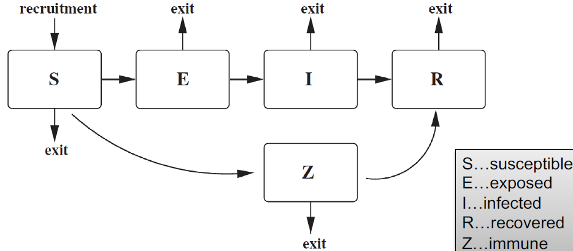
<!-- slide -->
* SIR模型：只有S、I、R三种角色，适用于天花等永久免疫疾病

* SIS模型：只有S、两种角色，适用于流感等病，病毒强度参数$s=\beta/\delta$

  - 假设网络为完全联通图，模型的动力学如下，左SIR，右SIS：

| $$\frac{d S}{d t}=-\beta S I$$ $$ \frac{d R}{d t}=\delta I$$   $$\frac{d I}{d t}=\beta S I-\delta I$$ | $$\frac{dS}{dt}=-\beta S I +\delta I$$ $$\frac{dI}{dt}=\beta SI-\delta I$$ |
|:-|:-| 
<!-- slide -->
* SIR、SIS模型的动力学图

* 传染病阈值$\tau$:如果传染病的强度$s=\beta/\delta<\tau$,则传染病将最终消亡，而传染病阈值$\tau=1/\lambda_{1,A}$,$\lambda_{1,A}$代表邻接矩阵的最大特征值，其代表了网络的连接程度，如对于$d-regular$网络，其代表了节点的平均度平均度越高则接触人数越多，爆发可能性越高。
* 在给定的病毒强度、感染阈值下，初始感染节点数不影响病毒最终的发展。
<!-- slide -->
* Ebola的动力学
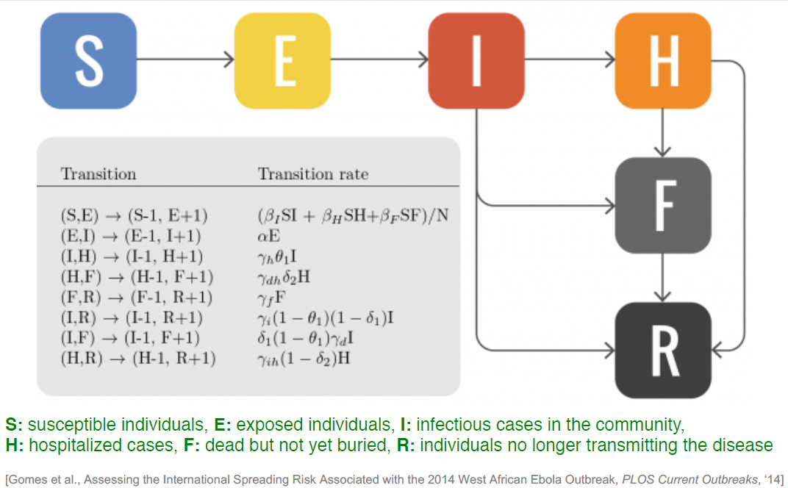
<!-- slide -->
* 应用：基于SEIZ的谣言传播模型
* S:一般Twitter账户,I:相信谣言并转发用户，E:接收到谣言但还没有相信的用户，Z:不信谣不传谣的用户。SEIZ模型能够较好地拟合谣言传播事件
* 模型的动力学

<!-- slide -->
* 基于SEIZ的谣言检测模型
  - 测度标准：$R_{S I}=\frac{(1-p) \beta+(1-l) b}{\rho+\epsilon}$类似于流通量比，即进入状态E与离开状态E的比例。对于谣言，离开的人数要远高于停留的人数。

<!-- slide -->  
* 独立级联模型
  - 给定初始感染节点子集$S$，边$(u,v)$的感染概率（权重）为$p_{uv}$,模型示意如下：

  - 如每条边都有独立节点，则模型过于复杂而不可行，故简化为暴露exposures和采纳两种状态
  - 暴露曲线：采纳新行为的概率与采纳新行为的邻接节点的个数构成的曲线。
<!-- slide -->
* 暴露曲线：

* 病毒营销的传播:商品推荐的发送者和接收者都可以获得折扣（拼多多模式）

 

<!-- slide -->
* 拟合暴露曲线
  - Persistence P:暴露曲线下的面积占$max{P},max{K}$矩形的面积。
  - Stickiness,即最大的采纳概率，即最有效的暴露次数对应的概率。
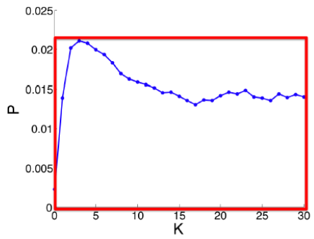
<!-- slide -->
# 十四、网络中的影响力最大化
<!-- slide -->
* 影响力最大化：给定有向图，找出使整个网络中被影响的节点尽可能多的k个种子节点。主要方法是Linear Threshold Model和Independent Cascade Model.
* Linear Threshold Model:对于节点v,其接收病毒营销推荐的阈值未$\theta_v \sim U[0,1]$,其被邻居节点$w$影响的权重为$b_{v,w}$，则$\sum_{w\in N(v)}{b_v,w} \leq 1$,节点v被影响的条件为：$\sum_{w\in N(v)}{b_{v,w}}\ge \theta_v$。与ICM的不同在于，ICM是以概率独立且随机地影响邻居节点

<!-- slide -->
* 最大影响节点子集：即包含k个最大影响节点的集合，其能够产生最大的期望cascade size$f(S)=|\cup_{u\in S} X_u|$，其中$X_u$为节点u所能影响到的节点集合，注意ICM是独立随机模型，所以其大小必须以期望衡量
* 寻找最大影响节点子集是一个NP-complete问题。

<!-- slide -->
* 最大影响节点子集发现的近似算法：Greedy Hill Climbing算法，即选择使边际增益最大的节点,即$max_{u}f(S_{i-1}\cup {u})$,该算法能保证$f(s)\ge (1-1/e)\cdot f(OPT)$，即最差接近最优解的0.63倍,算法复杂度为$O(k\cdot n\cdot R\cdot m)$,其中n为图中节点数目，R为随机模拟次数，m为边的数目。
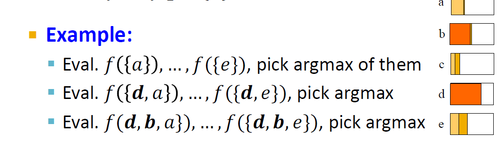
* 其中$f$满足次可加性：如果$|T|>|U|$,则$|f(S\cup u)-f(S)\ge f(T\cup u)-f(T)$
<!-- slide -->
* 实证检验：co-author网络
  - 三种对比方法：degree centrality，选取度最大的k个节点；closeness centrality,选择最可能是网络中心的k个节点；random,随机选k个。

<!-- slide -->
* sketch-based算法，对于给定有m条边的节点集，常规的评估其影响力的时间复杂度为O(m),使用sketch-based算法可以将时间复杂度降为$O(1)$,劣势在于不能保证"真实"期望影响力中的收敛性。
  - 思路为对每个节点首先估计一个较小结构的影响力，然后根据估计的影响力进行影响力最大化。
  - 具体步骤：首先以[0,1]均匀分布为每个节点指定一个参数，根据参数计算每个节点v的rank,即每个节点v所能到达的节点中最小的指定参数.如果一个节点能够到达很多节点则其rank应当会比较小，所以rank可以用于估计节点的影响力
  - 由于基于一次rank估计可能会不准确，因此使用多次模拟中、多次rank估计中最小的c个值，如此每个节点都有c个rank,最后根据rank值进行贪婪算法