<!-- slide -->
* 目录

[toc]
<!-- slide -->
# 十五、outbreak detection
<!-- slide -->
* 断点检测
  - 如检测水源的污染源，媒体传播的信息源，网络安全问题等等
  - 给定图$G(V,E)$和污染过程$T(t,i)$(outbreak i污染节点u的时间)，在一定的预算约束$cost(S)<B$下选择节点子集$S$检测，使得感知的期望奖励最大，即$max f(S)=\sum_i{P(i)f_i(S)}$,其中$P(i),f_i(S)$分别为outbreak i发生的概率，及检测到outbreak i的期望奖励。
  - 奖励可能的形式：1，最小化检测时间；2，最大化感知传播次数；3，最小化影响人数；
  - 成本可能的形式：设置感知器的成本；阅读新闻的时间成本等等。
<!-- slide -->
  - (在时间t内感知到的)惩罚的形式：1，感知时间，$\pi_i(t)=t$;2,感知可能性，即感知到多少次污染,$\pi_i(t)=0,\pi(\infty)=1$;3,影响人数，$\pi_t(t)=时间t内x爆发影响的人数$.
  - 感知奖励：$f_i(S)=\pi_i(\infty)-\pi_i(T(S,i))$,使用感知惩罚的边际作为奖励的原因在于，这种形式具有次可加性。
  - 优化次可加性一般使用贪婪爬山算法，但贪婪爬山算法只能处理单位成本相同的情况，且速度慢，复杂度高，$K$个传感器的计算复杂度为$O(|V|\cdot K)$。
<!-- slide -->
* CELF算法
  - 如果忽略成本，贪婪爬山算法总是倾向于选择具有较高奖励的传感器，从而可能会出现任意差的结果，因此可以考虑优化收益-成本比，但仅使用收益-成本比，也会出现任意差的结果，但如果将二者结合则可以保证优化结果的收敛性，算法即成本效率懒惰前向搜索法(Cost-Effective Lazy Forward-selection).
  - 定义$S'$为收益-成本贪婪算法的优化结果，$S''$为单位成本贪婪算法的优化结果，最终的优化结果定义为：$S=arg max(F(S'),f(S''))$.
  - CELF的优化收敛性：$\frac{1}{2}(1-\frac{1}{e})$
<!-- slide -->
* Lazy Evaluation
  - $\delta_i(u)=f(S_i\cup \{u\})-f(S_i)$,如果$S_i<S_j$，则$\delta_i(u)\ge \delta_j(u)$。
  - Lazy Hill Climbing的主要思路就是利用$\delta_i$作为$\delta_j$的上界，即维护一个上一轮迭代产生的$\delta$的有序列表，对处于头部的节点重新估计$\delta$，并按估计值重新进行排序，若某节点新的$\delta$最大且大于上一轮的某个节点$\delta$则停止排序，将该节点加入已选节点集。

<!-- slide -->
* 求解质量的数据依赖边界
  - 数据质量决定的求解的质量。令$\delta(1)\ge \delta(2)\ge ...$,则$f(OPT)\leq f(S)+\sum_{i=1}^k{\delta(i)}$,该不等于即数据依赖边界，对于某些输入，该边界可能得的的结果差于最优解的$63\%$(一次实验)。
* 案例分析：供水网络
  - 21000个节点，25000条边，每月50台机器的集群，模拟了36亿个传染场景。

<!-- slide -->
* 案例二：cascades in blogs
  - 45000个blogs,100亿更新，识别出350000传播，检测blog节点的成本即该blog发布更新的数量。

* CELF两个子算法中，收益成本比的效果更好；
* CELF倾向于选择只参与很少次传播过程的、小的blogs
<!-- slide -->
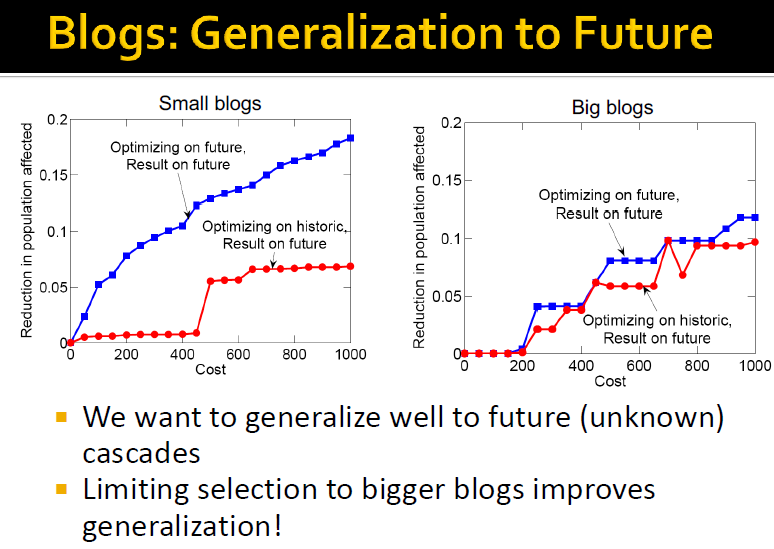
<!-- slide -->
# 十六、networks evolution
<!-- slide -->
* evolving networks:动态网络
  - 网络的边和节点会随时间变化，如社交网络中，网络中会加入新的成员，无交集的节点会变成朋友，朋友会绝交或失去联络，等等。
  - 网络的动态变化有三种层次：宏观（动态网络模型变化，densification变化）、中观（motif变化，社区变化）、微观（节点和边的变化，如连接性质的变化，如度，集中度）。
* 网络的宏观演化,如随着时间变化，网络的边和节点会如何变化，网络的直径如何变化，度分布如何变化。
  - 如果节点扩张两倍，边将呈指数变化，即densification power law,$E(t)\propto N(t)^a,\ \ a\in[1,2]$,如果为1，则代表图是一个out-degree为常数的图，如果为2，则代表图是一个全连接图。
<!-- slide -->
  - 在实际网络中，随着节点的增加，网络的直径将变小（实际计算常常只考虑连通部分的90%分位数或平均路径长度，但结论是一致直的），其原因在于密集度幂律导致边也在增加。
  - 但在E-R随机网络中，虽然密集度也$1<a<2$,但直径是以$logN$倍数变大的，因此直径收缩的原因不仅在于密集度，也在于度分布。结论：密集度序列+度分布序列的变化可以解释图直径的变化。
  - 选择1：度指数$\gamma_t$(度与处于该度水平节点数所画出的散点图的斜率)为常数，事实1：度指数与密集度存在如下关系：$\gamma=2/a$，因此如果度指数$\gamma$为常数，即密集度为常数，则平均度将增加。
<!-- slide -->
  + 选择2：$\gamma_t$随着节点的增多而增大，事实2：如果$\gamma_t= \frac{4n_t^{x-1}-1}{2n^{x-1}_t-1}$,则$a=x$，由于平均度满足$E(X)=\frac{\gamma_t-1}{\gamma_t-2}x_m$,故如果节点数增加，则$\gamma_t$减小，若密集度不变或增加，则平均度增大。
  * 选择1示例与选择2示例
  

<!-- slide -->
* 森林火灾模型
  - 用于建模随时间变化图变得更密集且直接越短，如写论文时的参考文献，在聚会上交朋友等。
  - 森林火灾模型有两个参数，前向引燃概率p,后向引燃概率r，因此模型适用于有向图。
  - 每一轮都有一个新节点$v$进入网络，以均匀分布选择一个节点$w$作为使者节点；以几何分布$G(p)，G(rp)$选择w入和出连接的数量，即传播火势；“火势”递归地传播直到消亡；最终新节点v将与所有已经点燃的节点相连。
<!-- slide -->
* 森林火灾模型示例
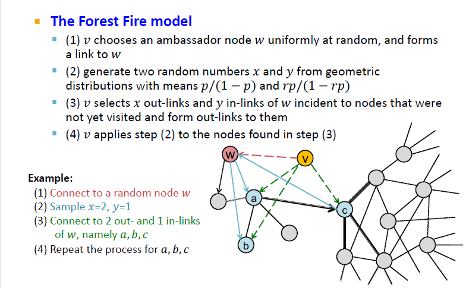
<!-- slide -->
* 森林火灾模型产生的图具有密集且收缩的直径。

<!-- slide -->
* 森林火灾的相位转移
  - 其中实线为度指数，虚线为密集度
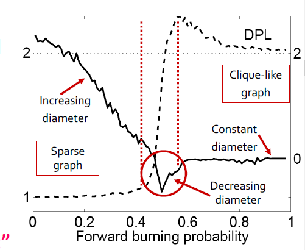
<!-- slide -->
* 时序网络(Temporal Networks)
  - 由相同节点集构成的静态有向图的序列。每个时序边都是由时间戳编码的网络$((u,v),t_i)$，其中$t_i$表示在该时间点$u,v$存在连接。
  - 应用于通信，代理网络，运输网络，细胞生物学等
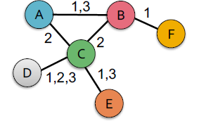
<!-- slide -->
* 微观进化
  - 问题：如何定义时序网络中的路径，能否将网络中心度(centrality)的概念推广到时序网络
  - 时序路径：$\{(u_i,u_{i+1},t_i)\},i=1,...,T$构成的序列，每个节点至多只访问一次。
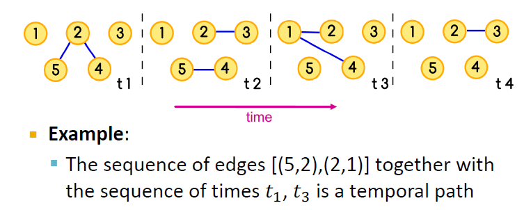
<!-- slide -->
* 用于发现时序最短路径的TPSP-Dijkstra算法
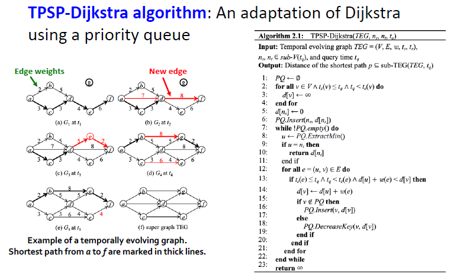
<!-- slide -->
* 时序中心度
  - 时序近邻度（closeness),衡量在时间区间$(0,t)$内，一个节点与另一个节点近邻程度，计算方法是计算该节点相对所有其他节点的最短时序路径的长度之和$c_{clos}(x,t)=\frac{1}{\sum_y}{d(y,x|t)}$。
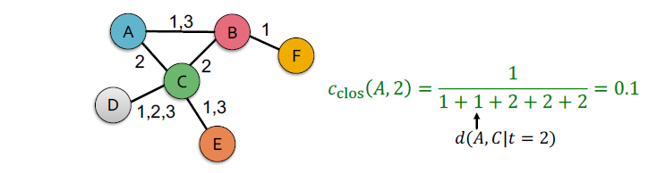
<!-- slide -->
* 时序PageRank
  - PageRank以入连接作为节点重要性的指标，但入连接会随着网络的动态变化而变化，因此节点的重要性也会变化。
  - 时序PageRank的主要思路是，根据时序路径进行随机游走（即路径的选择按照时间先后顺序）。
  - 时序路径的条件概率可由指数分布模拟，即随着时间间隔$(t_2-t_1)$的增大，在$t_1$经由路径$(u,v)$的条件下，在$t_2$时刻选择路径$(u,x)$的可能性会降低，$P[(u,x,t_2)|(v,u,t_1)]=\beta^{|\Gamma_u|}$,其中$\Gamma_u$为$[t_1,t_2]$内所有经过$u$的时序边的集合，而如果$\beta$越小，模型停留在度较高的节点的概率越高，但收敛更慢。
<!-- slide -->
* 当$t\rightarrow \infty$,时序PageRank将收敛于静态PageRank。因为时序PageRank是时间增益的常规PageRank，当时间趋于无穷，时序walk进入该节点后将不再离开，$P[((u,t_1),(x,t_2))|((v,t_0),(u,t_1))]=\beta^{|\Gamma_u}$将服从均匀分布，看起来就像将所有时间点的图重叠在一起，从而变为静态图。
* Temporal PageRank,$r(u, t)=\sum_{v \in V} \sum_{k=0}^{t}(1-\alpha) \alpha^{k} \sum_{z \in Z(v, u \mid t)} P[z \mid t]$，其中在时间$t$内所有由$v$到$u$的时序walk的集合，$\alpha$为开始新walk的概率。
* Temporal Personalized PageRank,$r(u, t)=\sum_{v \in V} \sum_{k=0}^{t}(1-\alpha) \alpha^{k} \frac{h^{*}(v)}{h^{\prime}(v)} \sum_{z \in Z(v, u \mid t)} P[z \mid t]$,其中$h^*$为个性化向量，$h'$为walk开始概率向量，$h^{\prime}(u)=\frac{|(u, v, t) \in E: \forall v \in V|}{|E|}$.
<!-- slide -->
* 加权的时序walk数量z定义为：$c(z|t)=(1-\beta)\prod_{\left(\left(u_{i}, u_{i+1}, t_{i+1}\right) \mid\left(u_{i-1}, u_{i}, t_{i}\right)\right) \in \mathbb{Z}} \beta^{\left|\Gamma_{u_{i}}\right|}$，其中$1-\beta$为时序walk停止的概率。
* 在时间$t$内某条概率出现的概率为$P(z\in Z(v,u|t))=\frac{c(z|t)}{\begin{array}{c}
\sum_{Z^{\prime} \in Z(\mathcal{V}, x \mid t)} c\left(Z^{\prime} \mid t\right) \\
x \in V,\left|z^{\prime}\right|=|z|
\end{array}}$,其中分母的含义为从节点$v$开始，且长度与$z$相同的时序walk的数量。
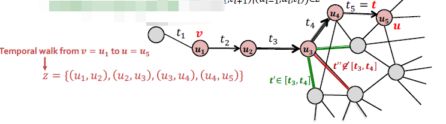
<!-- slide -->
* 时序PageRank计算r的算法
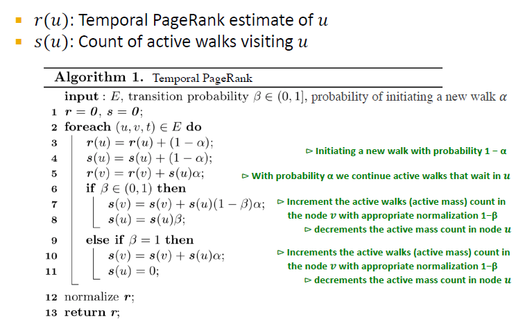
<!-- slide -->
* 时序PageRan案例分析：
  - 数据：Facebook,Twitter,UC-irvine的学生社区活跃度日志。
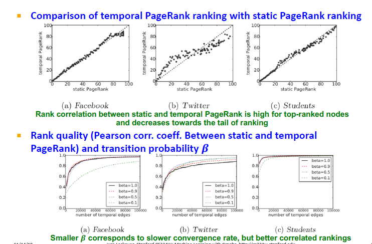
<!-- slide -->
* 案例分析：对观念漂移的适应性
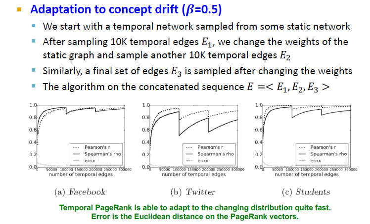
<!-- slide -->
* 网络的中观动态演化
  - 随着网络的变化，某些交互模式如何变化(motif)
  - 时序motifs,定义为k个节点-l条边-时间间隔$\delta$内的motif,即$l$条边的时序序列$(u_1,v_1,t_1),...,(u_l,v_l,t_l)$，其中$t_l-t_1\leq \delta$,从这些边导出(induced)静态图是连通且有k个节点。
  - 时序motif实例：时序图中一些边的集合即是一个$\delta-temporal\ motif\ M$，如果$M$满足：(1)符合边的连接模式，(2)所有边在时间窗$\delta$内以motif模式中正确的顺序出现。
<!-- slide -->
* $\delta-temporal\ motif\ M$示例
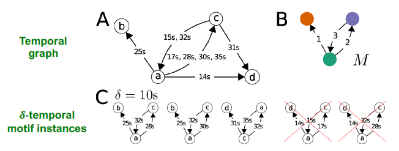 
* 时序motif案例分析

<!-- slide -->
* 阻塞通信，如果某人通常在等待与另一人进行交流之前需要先等待一个人的回复，我们称之为blocking communication
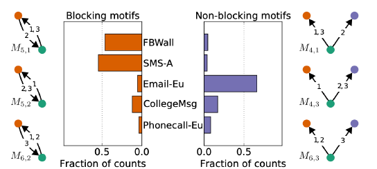
* 转移代价，深度越深转移代价越高。
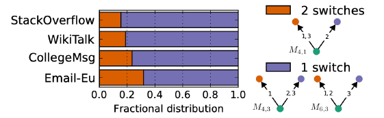
<!-- slide -->
* 时变的motif计数
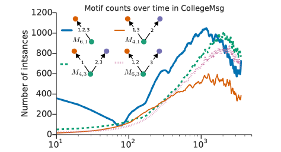
* 金融网络的时序motif

<!-- slide -->
# 十七、基于知识图谱的推理
<!-- slide -->
* 知识图谱
  - 知识图谱用于捕捉实体、类型和关系。其中节点代表实体，他们的标签代表他们的类型，节点之间的边代表关系。
  - 如引文网络中实体有：论文、题目、作者、会议、发表年份；关系有：pubWhere, pubYear, hasTitle, hasAuthor, cite。
  - 知识图谱的应用包括问答系统、对话机器人，目前流行的数据集有FreeBase, Wikidata, Dbpedia, YAGO, NELL, etc.他们的特点是：大规模但不完全，因此知识图谱补全是知识图谱建设的一项主要内容。
<!-- slide -->
* 知识补全，即在给定的实体下，预测他们的关系
  - 知识图谱中的边通常表示为三元组，头实体h、尾实体t和关系r。
  - 关系的模式有：对称关系$r(h,t)\Rightarrow r(t,h)$；复合关系$r_1(x,y)\wedge r_2(y,z)\Rightarrow r_3(x,z)$;1对N，N对1关系：$r(h,t_1)...r(h,t_n)$均为真。例如关系r为“StudentOf”
  - 最基础的知识嵌入算法TransE,其得分函数：$f_r(h,t)=||h+r-t||$，损失函数为：$\mathcal{L}=\sum_{(h, r, t) \in G,\left(h, r, t^{\prime}\right) \notin G}\left[\gamma+f_{r}(h, t)-f_{r}\left(h, t^{\prime}\right)\right]_{+}$,其中$\gamma$是有效三元组和无效三元组之间的最小距离边际。
  - TransE的局限在于他不能处理1对N或N对1的关系，因为TransE会把相同关系的实体映射为同一表示形式。
<!-- slide -->
* TransR将实体和关系映射入不同的表示空间，然后再建立一个映射矩阵，将实体映射入关系的表示空间。$h_{\bot}=M_rh, t_{\bot}=M_rt$,$f_r(h,t)=||h_{\bot}+r-t_{\bot}||$
* TransR的缺点在于他不能处理复合关系
* 知识图谱中的查询类型有如下四种：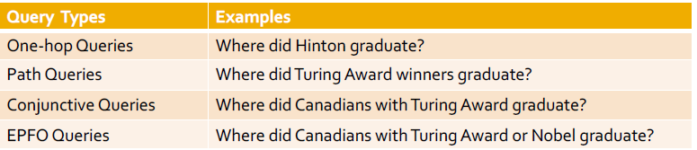
* 我们可以把知识图谱中的链路预测问题表示为One-hop问答
* One-hop查询可以通过增加更多的关系扩展为路径查询$q=(v_a,r_1,...r_n)$
<!-- slide -->
* 我们可以通过遍历知识图谱来回答路径查询，但是如果知识图谱是不完全的，则遍历无法操作。通常我们无法通过先补全知识图谱再遍历知识图谱回答路径查询，因为完整的知识图谱是一个密集的图，在密集的图上查询一个拥有|V|个实体的n步路径查询，其时间复杂度为$O(|V|^n)$
* 此时我们可以先将查询进行嵌入，根据路径查询的嵌入计算其最终指向的实体或关系的向量表示，然后进行搜索完成问答，其时间复杂度为$O(V)$
* 联合查询(Conjunctive Queries)即多条件查询，例如“Where did Canadian citizens with Turing Award graduate?”，方法同样是查询嵌入，但需要进行取交集操作，这里的方案是神经网络交集操作Neural Intersection Operator
<!-- slide -->
* Neural Intersection Operator $J$
  - J具有乱序(permutation)不变性$J(\mathbf{q}_1,...,\mathbf{q}_m)=J(\mathbf{q}_{p(1)},...,\mathbf{q}_{p(m)})$,其中$\mathbf{q_1},...,\mathbf{q_m}$为查询向量，$\mathbf{q}$为交集向量，$[p(1),...,p(m)]$为$[1,...,m]$的任意乱序。 
  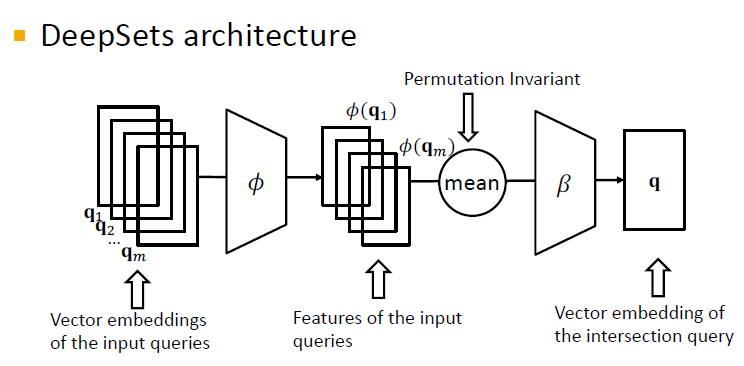
<!-- slide -->
* Neural Intersection Operator的距离函数$f_q(v)=||\mathbf{q-v}||$,其中$v$代表实体的嵌入向量，$q$代表查询的嵌入向量，其训练参数个数分别包括：实体嵌入$d|V|$,关系嵌入$d|R|$,交集操作$\phi,\beta$
* 训练过程为：1.采样查询q，答案v，负样例v'，2.嵌入查询向量$\mathbf{q}$,3.计算距离$f_q(v),f_q(v')$,4.优化损失函数。
* 查询过程为：1.给定测试查询q，计算嵌入向量$\mathbf{q}$，2.对于知识图谱中的所有v，计算距离$f_q(v)$,3.根据距离给v排序，给出最终答案。
* 每次查询都需要遍历知识图谱中的所有实体，时间复杂度较高，解决办法使用新的几何距离-->Box Embedding
<!-- slide -->
* Box Embedding
  - 把查询嵌入到一个超矩形内（boxes）$\mathbf{q}=(Center(q),Offset(q))$,Box是非常有效的嵌入方式，因为我们可以映射中心点并控制偏移来对实体的集合进行建模。
  - Boxing Embedding的参数量有：实体嵌入$d|V|$,每个实体可以视为一个零列的box；关系嵌入$2d|R|$，每个关系都包含中心和偏移两个维度；交集操作参数$\phi,\beta$,其作用为将输入的多个box映射为一个box  

<!-- slide -->
* 映射操作

* 几何交集操作$J:Box \times ... \times Box \rightarrow Box$,新中心是原中心的加权平均，而边际将随着交集操作而收缩
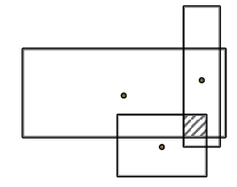
<!-- slide -->
* 中心和偏移的公式
$\operatorname{Cen}\left(q_{\text {inter}}\right)=\sum_{i} w_{i} \odot \operatorname{Cen}\left(q_{i}\right)$，
$Off\left(q_{\text {inter }}\right)=min(Off(q_1),...Off(q_n))\odot\sigma(Deepsets(\mathbf{q_1,...q_n}))$,其中$\odot$代表元素级的相乘，$\sigma$代表sigmoid函数，从而将输出限制在[0,1]
* 实体 to box的距离定义为：给定查询box $\mathbf{q}$和实体$\mathbf{v}$，$d_{box}(\mathbf{q,v})=d_{out}(\mathbf{q,v})+\alpha \cdot d_{in}(\mathbf{q,v})$，根据实体是head或tail而分为$d_{out},d_{in}$
* Query2box的损失函数为，$ \mathcal{L}=-\log \sigma\left(\gamma-d_{\text {box}}(q, v)\right)-\log \sigma\left(d_{\text {box}}\left(q, v_{i}^{\prime}\right)-\gamma\right) $
* Query2Box可以解决对称、复合和1-N或N-1的关系嵌入问题。 
<!-- slide -->
* 示例：query2box应对N-ary关系的原因在于它可以将不同尾实体$(t_1,t_2)$映射入$(h,r)$box的不同位置。
* 示例：对于对称关系，我们可以设$Center(r)=0$，如此只要尾实体在$(h,r)$box中，就能保证$h$在$(r,t)$box中
* 示例：对于复合关系，query2box可以保证：$\mathbf{r_3=r_1+r_2}$,对于复合关系，如果y在box$(x,r_1)$里，z在box$(y,r_2)$里，则query2box可以保证z在box$(x,r_1+r_2)$里。
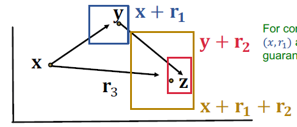
<!-- slide -->
* Existential Positive First-order(EPRO) 存在性正一阶查询是一种联立（conjunctive）加析取(disjunction)查询，例如“Where did Canadians with Turing Award or Nobel graduate?”，这种查询同样可以设计disjuntion operator，并将EPFO查询映射入低维向量空间。
* 查询生成：给定查询结构和前向遍历顺序（从根节点到叶节点），去指定每个节点或边的实体或关系，然后根据后向遍历顺序(从叶节点到根节点)查找答案；对于测试查询，我们必须要保证他们不能在验证集或训练集上找到答案。
* 最后可以用T-SNE将嵌入的结果映射到一个二维空间进行可视化。
<!-- slide -->
# 十八、图网络的局限
<!-- slide -->

* 1 能应对复杂任务却难以识别简单的模式

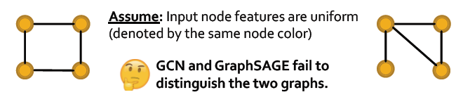
  - 1.1 图同构测试即如果图表示方法是否确定性地将不同的图映射为不同的表示，目前为止，不存在可以完美解决该问题的多项式算法，GNNs也不例外。
  - GNNs使用不同的计算图来进行图表示，捕获根子树的结构(rooted subtree)进行节点表示。
<!-- slide -->
  - 1.2 节点能获得唯一表示的必要条件是映射是单射的(injective,即原像不同则像不同），而整个近邻聚合是单射的必要条件是每一步近邻聚合都是单射的。
  - 而近邻聚合必须是一种多重集函数，因为它必须能处理不同的节点。
  - GCN使用的聚合函数是mean pooling，但Mean对于等比例的multi-set不具有识别性
  - GraphSAGE使用max pooling,但max对不同元素个数的multi-set不具有识别性。

<!-- slide -->
* 1.3 构造具有单射性的多重集函数
  - 定义：任何单射的多重集函数可以表示为如下形式
  $$\phi\left(\sum_{x\in S}{f(x)}\right)$$
  其中，$\phi,f$都是非线性函数，一个比较理想的选择为MLP，这就是GIN算法的出发点。
* 1.4 Graph Isomorphism Network算法
  - GIN的主要改进即使用MLP+sum pool进行近邻聚合，这样构成的聚合函数是单射的。
  - GIN受Weisfeiler-Lehamn图同构测试的启发，WL测试能够识别现实世界的大多数图，二者在效果上具有等价性。
<!-- slide -->
  - 因此二者对于一些焦点情形不具有识别性，因为这些情况往往具有相同的局部子树结构，如下图

  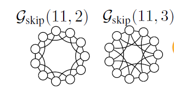

  - GIN在生物化学社交多项图任务上表现优于GCN,GraphSAGE.

<!-- slide -->
* 2 对噪声敏感，不够稳健。

  - 2.1 以下基于GCN的半监督节点分类问题来说明。令$A,X,\hat{A}=D^{-\frac{1}{2}}(A+I)D^{-\frac{1}{2}}$分别表示邻接矩阵、特征矩阵、标准化邻接矩阵，则一个两步GCN信息传递分类器可表示为$softmax(\hat{A}ReLU(\hat{A}XW^{(1)})W^{(2)})$
  - 攻击分为直接攻击和间接攻击，直接攻击有修改修改目标的特征、增加/移除与目标的连接；间接攻击包括，修改攻击者的特征，增加/移除与目标的连接
<!-- slide -->

* 直接攻击和间接攻击示意图

* 2.2 攻击的目标是在有限的噪音约束下，使目标节点的预测标签变化最大，公式化的表示为：

$\arg \max _{A^{\prime}, X^{\prime}} \max _{c \neq c_{\text {old }}} \log Z_{v, c}^{*}-\log Z_{v, c_{\text {old }}}^{*}$
where $Z^{*}=f_{\theta^{*}}\left(A^{\prime}, X^{\prime}\right)=$
sof tmax $\left(\hat{A}^{\prime} \operatorname{ReLU}\left(\hat{A}^{\prime} X^{\prime} W^{(1)}\right) W^{(2)}\right)$,
with $\theta^{*}=\arg \min _{\theta} \mathcal{L}\left(\theta ; A^{\prime}, X^{\prime}\right)$
s.t. $\left(A^{\prime}, X^{\prime}\right) \approx(A, X)$
<!-- slide -->
* 在实际中，我们很难训练以上模型，因为图的修改是离散的，对于内层的计算涉及对GCN的再训练，非常耗时，因此目前仍然是使用一些近似算法。
* 3. GNNs的应用和挑战
  - 分子图，蛋白质交互影响图
  - 标签仍然稀缺，目前的预测仍然要基于分布。
  - 新的方法：图预训练模型
<!-- slide -->
# 十九、图网络的应用
<!-- slide -->
<!-- ## 1. 图网络的几个重要问题 -->
<!-- ### 1.1 定义相似性 -->
1. 基于内容（content-based）的方法：如用户和商品的特征;
2. 基于图（graph-based）方法：用户-商品的交互，即图结构。
   - 基于这种方法的推荐称为协同过滤(collaborative filter),对于给定的用户$X$，找到其他喜欢相似商品的用户，基于相似用户的爱好估计用户$X$的爱好。
3. 如何定义相似性包括以下问题：
   - 1),如何搜集已知的相似商品，即训练问题；2），如何根据已知的相似性，推测未知相似商品，即预测问题；3），如何定义估计方法，如何估计推荐结果的表现，即测度问题。
<!-- slide -->
<!-- ### 2.1. 图神经网络的应用一：推荐系统 -->
* Pinterest,一个将有兴趣的同类图片或内容订在PintrestBoard上的应用。因此Pinterest上有两种信号，一种是Pin的特征，一种是图特征，且图是动态的，故要求我们的模型必须是Inductive。
* 基于Embedding的推荐分为两个步骤：一，使用Inductive的Embedding方法对商品和用户进行嵌入，二，对推荐商品执行实时近邻查询。
* PinSage的流程：1，采集大量的正样例（在一段时间内在同一个board上的商品）和负样例（两个随机商品）；2，训练GNN网络，基于正负样例进行对比训练；3，对所有商品进行嵌入；4，执行最近邻查询。
<!-- slide -->
* PinSage的主要创新点：
  - 1，即时的图卷积，即执行针对特定节点执行局部图卷积，不需要整个图来训练，每一轮只计算源节点；
  - 2，基于随机游走选择近邻节点。首先预定义聚合节点个数$K$,然后执行随机游走，基于Personalized PageRank定义近邻节点的重要性，根据重要性选择（最高访问次数的）节点（并不必须是近邻节点），然后基于重要性进行average pooling,即Importance Pooling；
<!-- slide -->
  - 3，高效的图简化(MapReduce)推断。如果仅使用局部图卷积，在推断中将出现大量重复计算，避免重复计算可以提高效率，方法是存储计算过的计算图（motif），重复利用如下图：

  

  - 4，逐步增加难以区分的负样本，即逐步增加训练难度，Curriculum训练。选择高相似负样本的方法，依然是random walk，即选择访问次数排名在$n\cdot K$（保留一定的margin）之后的样本。
<!-- slide -->
  - PinSage的表现

  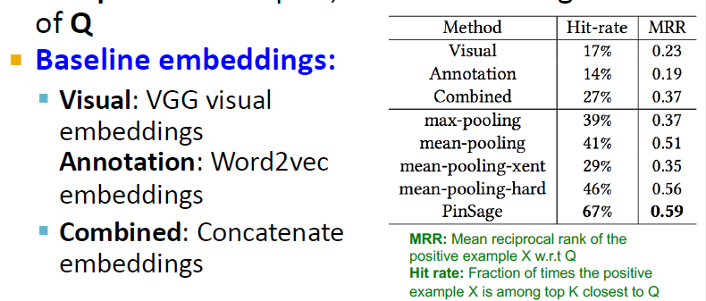
<!-- slide -->
<!-- ## 3. Decagon -->
* 3 Decagon
* 3.1 处理异质网络，如复方的副作用网络，需使用分子、药理和病患数据，三者构成异质的multimodal图如下：

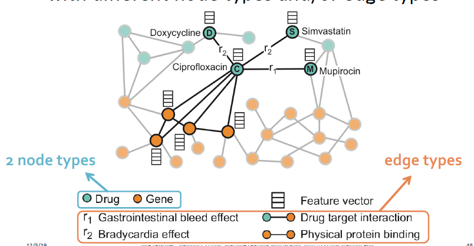
<!-- slide -->
* 3.2 问题为：给定部分可观测图，预测药物节点间的连接的标签，如下图

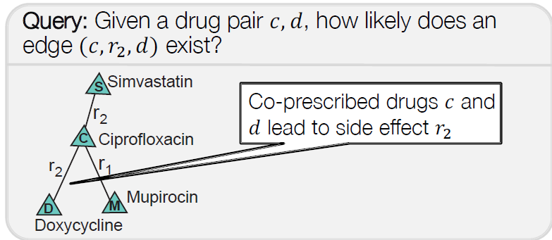
<!-- slide -->
* 3.3 模型：Hterogenous GNN
  - 训练的主要思想是，分别计算边的GNN信息，然后将边信息聚合，如下图：

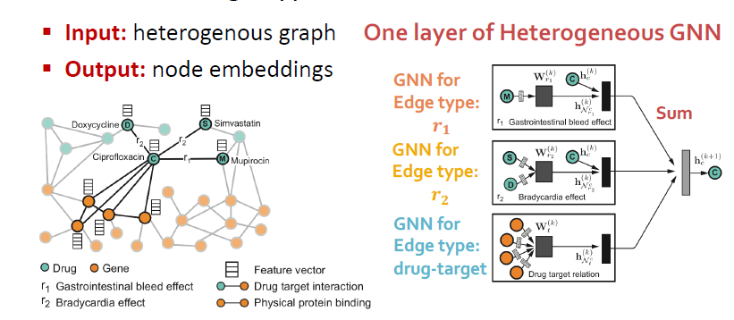
<!-- slide -->
  - 3.4 预测的主要思想是，根据每一对节点的Embedding,预测边的存在性，如下图：

  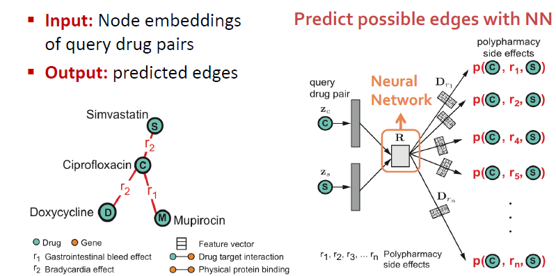
<!-- slide -->
  - 3.5 HeterogenousGNN的表现

  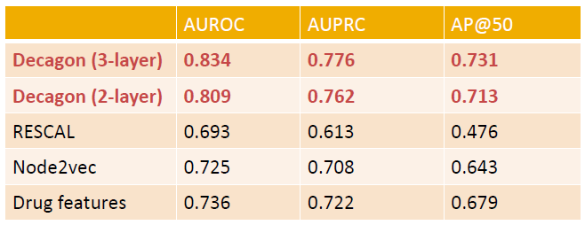

<!-- slide -->
<!-- ## 4. GCPN -->
* 4. GCNP(目标导向的图生成模型，GraphRNN的扩展)
* 4.1 图生成模型的范式：给定真实的图数据，使用模型拟合图模型的分布，然后基于分布采样图模型，生成新图。
* 4.2 GraphRNN的思路是序贯地增加节点和边，学习节点和边的序列模式，然后根据学习到的节点和边的序列模式，序贯地增加节点和边，生成新图。
* 4.3 GraphRNN可以视为一种模仿学习，图的模仿学习可以用于新药物的发现，此类问题是一种目标导向的图生成问题，此类问题的难点在于目标函数的具体形式是未知的，我们需要使用强化学习来通过环境交互学习该目标函数。
<!-- slide -->
* 4.4 主要思路：用GNN学习网络结构信息，并执行每次状态转移中的有效性检验；然后用RL优化（即时或最终）奖励；通过对抗训练来模仿样本中的数据。主要流程如下：

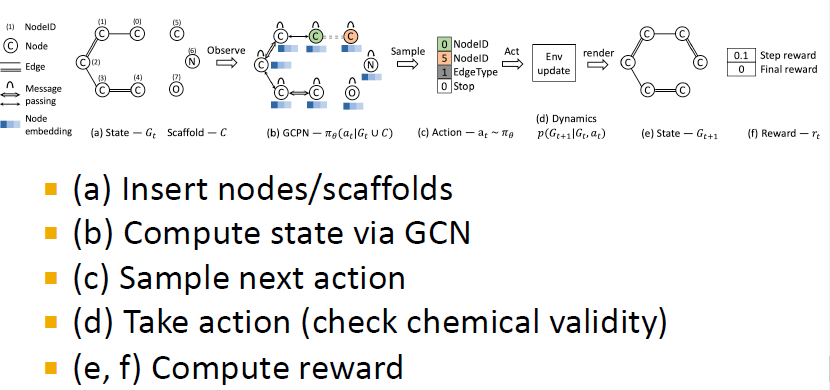
<!-- slide -->
* 4.5 设置奖励的方式：
  - 1，首先学习采取有效的行为，为每个有效行为指派一个较小的正分数；
  - 2，在每一轮的最后，如果采取的行为有较好的化学性质，指派一个正向奖励；
  - 3，最后，使用对抗训练训练一个GCN判别器，计算对抗奖励，鼓励网络生成符合现实的分子图。
  - 故每一轮的奖励：$r_t= Final\  reward + Step\ reward$,Final Reward为根据领域知识指定的奖励，Step Reward为每一步的有效性奖励。
<!-- slide -->
* 4.6 训练的方式：训练有两部分，监督训练和强化学习训练。
  - 监督训练，根据现实分子网络使用梯度下降进行模仿学习
  - RL训练，根据策略梯度算法训练策略网络。
* GCPN的框架如下：

<!-- slide -->
* 4.6 GCPN的效果

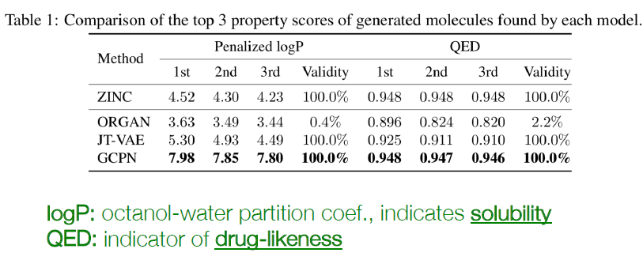

